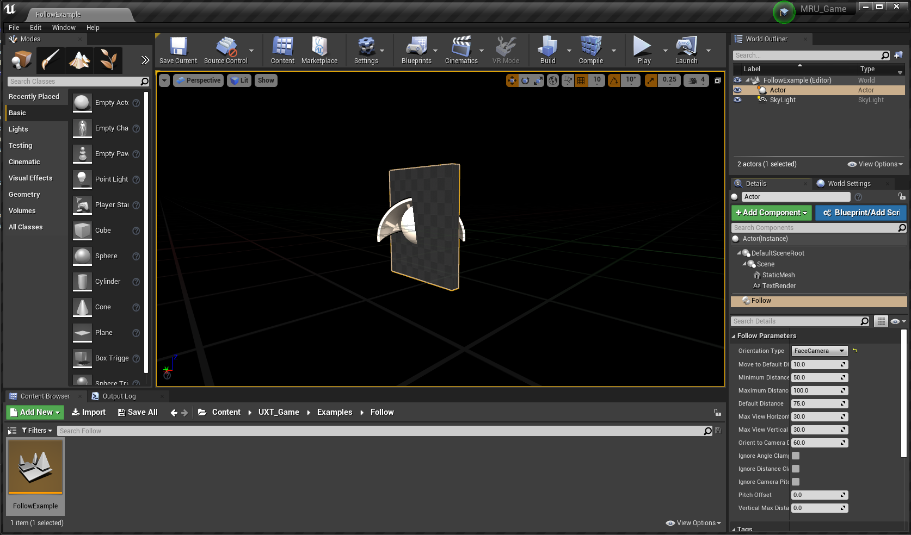

# FollowComponent

The FollowComponent is used to keep objects "following" the user by applying a set of constraints on the component's owner.

## Usage

Place a FollowComponent on your actor. In this example, we created an empty actor and added some geometry
and text to make a panel that we want to keep in front of the user.
Since we also want it to always face the user, we've set the "Orientation Type" to "FaceCamera".

**Hint:** The camera looks down the +X axis, so you may want the front face of your content be in the -X direction.

## Behavior Details

The FollowComponent has three different constraints that keeps its owner in front of the camera: Angular
Clamp, Distance Clamp, and Orientation. The combination of Angular and Distance Clamp creates a
frustum in front of the camera where its owner can be. If its owner is outside that frustum
it is adjusted.

**Angular Clamp**: The objective of this constraint is to ensure that the reference forward vector remains
within the bounds set by the leashing parameters. To do this, determine the angles between toTarget
and the leashing bounds about the global Z-axis and the reference's Y-axis. If the toTarget falls
within the leashing bounds, then we don't have to modify it. Otherwise, we apply a correction
rotation to bring it within bounds. This will ensure that the its owner stays within the
top, bottom, right and left planes of the frustum.

**Distance Clamp**: The objective of this constraint is to ensure that the following actor stays within bounds
set by the distance parameters. To do this, we measure the current distance from the camera to the
its owner. If the distance is within the MinimumDistance and MaximumDistance then we don't have to
modify it. Otherwise, we push away or pull in the its owner along the reference forward vector.
This will ensure that the its owner stays within the near and far planes of the frustum.

**Fixed vertical Offset**: The objective of this constraint is to ensure the following actor stays at a fixed vertical distance away from the camera. This can be used to ensure the following actor always sits above/below eye level to prevent the actor from obstructing the user's vision.

**Orientation**: The two options provided are constant FaceCamera or WorldLock. While world locked there are
three conditions that will cause the its owner to face the camera:
	Angular Clamps
	Distance Clamps
	The angle between the forward vector of the its owner and toTarget vector (vector between
		the camera and the its owner) is larger than dead zone angle parameter