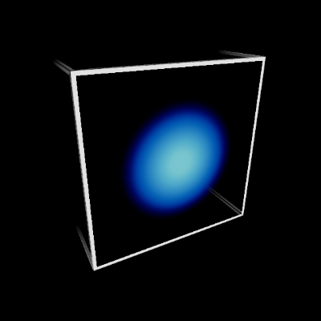
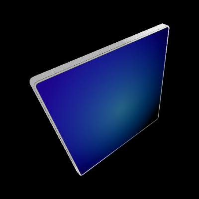

# Graphics

UX Tools contains a handful of graphics and rendering techniques to implement [Fluent Design System](https://www.microsoft.com/design/fluent) principles, and remain performant on Mixed Reality devices.

## Materials

Many mobile stereo headsets are [fill rate](https://en.wikipedia.org/wiki/Fillrate) bound, to reduce fill rate materials should be as simple, or inexpensive as possible. A handful of inexpensive [material instances](https://docs.unrealengine.com/en-US/Engine/Rendering/Materials/MaterialInstances/index.html) are included with the toolkit which derive from `M_SimpleLit_Color.`

`M_SimpleLit_Color` uses the Unreal [unlit lighting model](https://docs.unrealengine.com/en-US/Engine/Rendering/Materials/MaterialProperties/LightingModels/#unlit) to avoid extra computations, but uses the `MF_SimpleLit` material function to perform basic realtime [Blinn-Phong lighting](https://en.wikipedia.org/wiki/Blinn%E2%80%93Phong_reflection_model) on a single (virtual) directional light. The virtual directional light's properties are passed in via the `MPC_UXSettings` [material parameter collection](https://www.unrealengine.com/en-US/blog/material-parameter-collections).

> [!NOTE] 
> Unreal's built in [light types](https://docs.unrealengine.com/en-US/Engine/Rendering/LightingAndShadows/LightTypes/index.html) are not included within `MF_SimpleLit` calculations.

`MPC_UXSettings` contains global shader constants that are used to drive lighting effects as well as UI effects. For example, the left and right pointer positions are updated each frame within `MPC_UXSettings` to drive lighting effects emitted from the [hand interaction](HandInteraction.md) pointers.

## Shaders

To achieve visual parity with the HoloLens 2 shell, a couple of shaders exist in the _"UX Tools plugin root"/Shaders/Public/_ directory. A shader source directory mapping is created by the UX Tools plugin to allow any UE4 material to reference shaders within that directory as _/Plugin/UXTools/Public/Shader_Name.ush_. 

> [!NOTE] 
> Note, many of the shaders within this directory are generated from an external tool, and are not formatted for user readability.

A couple of shaders are described below in more detail, as well as any special considerations which must be made when using the shader.

### Button Box

The `M_ButtonBox` material and `Bounding_Box.ush` shader generate glowing edges on a cube with optional circular blob. The blob appears only on the active face set with the Blob_Active_Face parameter. The shader must be used with the correct corresponding cube model. The special model enables the shader to render only the visible areas of the surfaces. The last two letters of the `SM_FrontPlate_xx` model name indicates which face is active. For example, SM_FrontPlate_PY indicates the positive y-axis.

### Rounded Edge Thick

The `M_RoundedEdgeThick` material and `Rounded_Edge_Thick.ush` shader are designed to render a quad as an outlined rounded rectangle with depth. The shader works with a special mesh that approximates the round corners using triangles and includes additional information for anti-aliased silhouette edges. UX Tools includes several models named `SM_BackPlateRoundedThick_#` where # is the number of triangles per rounded corner. Use the model with the fewest triangles that works for your scenario.

> [!NOTE] 
> Note, the `SM_BackPlateRoundedThick_#` mesh and `Rounded_Edge_Thick.ush` shader assume the local y-axis is up, and not Unreal's traditional z-axis up. These assumptions were made when the `Rounded_Edge_Thick.ush` shader was authored in a separate content creation tool. To resolve these assumptions the `UxtBackPlateComponent` and `Rounded_Edge_Thick.ush` perform an additional rotation. This rotation is transparent to the end user and should not effect anything but advanced use cases. 

### Thick Finger Ring

The `M_FingerTipRing` material and `Thick_Finger_Ring.ush` shader with the `M_FingerTipRing` model are used to create a volumetric finger tip affordance.

### Bounding Box

The `M_BoundsControl` material and `Bounding_Box.ush` shader generate glowing edges on a cube with optional glowing blob and on/off transition effect. The shader must be used with the `SM_BoundsControl` model. The special models enable the shader to render only the visible areas of the box surfaces.

The above shader uses additive blending; if alpha blending is preferred a second method of creating the Bounding Box effects exists which works by splitting the box affordance into parts:

- The finger tip blob visuals are rendered using the `SM_BoundsControlFace` model with the `M_BoundsControlFace` material.
- Six copies of the `SM_BoundsControlEdge` model are scaled and offset to create the bound edges and rendered with the `M_BoundsControlEdge` shader.

## See also

- [Pressable button component](PressableButton.md)
- [Bounds Control](BoundsControl.md)
