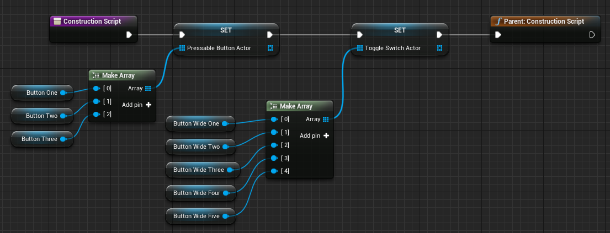
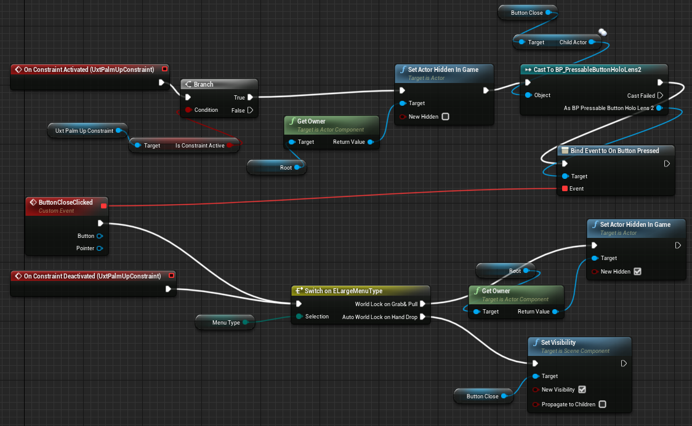

# Hand Menu

Hand menu is a user interface that appears whenever the user looks at their palm.

All of the pre-set hand menu variants can be found under:
`\Content\UXToolsGame\Examples\HandMenu`

## Creating a hand menu from scratch
Start off by creating a child blueprint deriving from the `BPBaseHandMenu`. In class defaults, select [Hand Back Plate Menu Layout](#Hand Back Plate Menu Layout) to be one of three sizes small, medium, large.

Additionally, the [menu type](#Menu type) needs to be set, this determines what type of functionality the menu will have when used with the `UxtPalmUpConstraint` component.

To add buttons to the hand menu, create a child actor and set the `ChildActorclass` to `BP_PressableButtonholoLens2`  which can be found under :`BlueprintGeneratedClass'/UXTools/Buttons/HoloLens2/BP_PressableButtonHoloLens2.BP_PressableButtonHoloLens2_C'` .

Toggle switch buttons have a visual on/off state. These can be found under :

`BlueprintGeneratedClass'/UXTools/Buttons/HoloLens2/BP_ButtonHoloLens2ToggleSwitch_Child.BP_ButtonHoloLens2ToggleSwitch_Child_C'`

In the construction script, buttons need to be added to their respective arrays. These arrays are declared in the base hand menu blueprint and will be used to assign properties to buttons.

Here is an example of the buttons and toggle switch child actors being added to their respective arrays:

Both sets of buttons use the SbuttonParm struct to assign values to each instance.  Add a number of elements in the respective arrays equal to the number of buttons/wide buttons created.

SbuttonParm arrays can be found under the properties of the blueprint actor.

SbuttonParm contains the follow properties:

**Button Label** - Sets the label text of the button.

**Button icon brush**

 Icon content type  - Describes what the icon brush content represents.
 Icon font - the font used by the Icon
 Icon string - string of characters representing the Unicode symbol or a literal string.

**Button Size**  - Sets the size of the button .

**IsPlated** - Should the menu have a backplate.

**Backplate Material**- Sets the backplate material.

**Pressed Sound**  - Sets the sound played **OnButtonPressed**

**Released Sound** - Sets the sound played **OnButtonReleased**

In order for the buttons to function, events need to be bound that respond to press/release. There are a few useful events that can be used:

- **OnBeginFocus**: This event is called when a pointer starts giving focus to the button.
- **OnUpdateFocus**: This event is called for every tick that the button has focus from a pointer. A button will hold focus while it is being pressed.
- **OnEndFocus**: This event is called when a pointer stops giving focus to the button.
- **OnButtonPressed**: Called when the current push distance of the button exceeds the [pressed fraction](# Pressed Fraction).
- **OnButtonReleased**: Called when the current push distance of the button subceeds the [released fraction](# Released Fraction).

Since the buttons are child actor instances of `Pressablebuttonhololense2`/`BP_ButtonHoloLens2ToggleSwitch_Child`, In order to bind to button events, it is necessary to first cast the child actor button to a its relative actor and only then can events be bound.

Here is an example of how to bind an event to a button instance:

Sliders are set up much like the buttons.  Assign BP_HandMenuSlider to a child actor component and add them to the slider actor array. Currently slider can only be found under the large menu variants.

`UxtPalmUpConstraint` is a component that enables hand constraint interactions and events,  Actors with the component on them will appear at their specified [zone](#zone).

Do note, If multiple actors are active with a  `UxtPalmUpConstraint`  component, make sure they do not overlap, by either adjusting the [goal margin](#Goal Margin) or the [zone](#zone) at which they appear at.

**On Constraint Activated**  - Event raised when the constraint becomes active.

**On Constraint Deactivated** - Event raised when the constraint becomes inactive.

**On Begin Deactivated** - Event raised when the constraint begins tracking a hand

**On End Tracking** - Event raised when the constraint ends tracking a hand.

**On Component Activated** - Called when component has been activated.

**On Component Deactivated** - Called when component has been deactivated.

Here is an example of some of the `UxtPalmUpConstraint` events being used. Whenever **On Constraint Activated** is fired,  the actor is made visible, alternatively when **On Constraint Deactivated** is fired then the actor is hidden.

Adjusting the [zone](# Zone) will be necessary initially to give an offset to the actor from the hand. Once all of the above is complete, it should look something like this:

This example uses a medium [Hand Back Plate Menu Layout](# Hand Back Plate Menu Layout) size, `Pressablebuttonhololense2` buttons and is a **World lock on grab and pull** [menu type](#Menu type).

## Public Properties

### Menu type

**World lock on grab and pull**  - These menus appear/disappear depending if the user is looking at their palm and will world lock when grabbed.

**Auto world lock on hand drop** - These menus world lock  after the user stops looking at their palm.

### Is Palm Active

Determines whether the UxtPalmUpConstriantComponent is active on begin play.

### Backplate Mesh

The selected thickness of the mesh black plate.

### Backplate Static Mesh

Array that contains backplate static meshes.

### Hand Back Plate Menu Layout

Contains different pre-set sizes for the backplate of the menu.

### Max Palm Angle

Maximum allowed angle between the negative palm normal and view vector. If the angle exceeds the limit the hand is not used.

### Require Flat Hand

If true then the hand needs to be flat to be accepted. The triangle between index, ring finger, and palm needs to be aligned with the palm within MaxFlatHandAngle.

### Max Flat Hand Angle

Maximum allowed angle between palm and index/ring finger/palm triangle to be considered a flat hand.

### Hand

Hand to use for the constraint. If set to 'Any Hand' the first tracked hand will be used, until tracking is lost.

### Zone

 Safe zone that determines the target location of the constraint relative to the hand.

### Offset Mode

Determines how the offset vector is computed

### Rotation Mode

Determines how the goal rotation is computed.

### Goal Margin

Margin between the hand bounding box and the goal location.

### move owning actor

Actor transform is moved towards the goal if true. Disable this to only compute the goal without changing the actor transform.

### Location Lerp Time

Interpolation time for smoothed translation. Set to zero to disable smoothing.

### Rotation Lerp Time

Interpolation time for smoothed rotation. Set to zero to disable smoothing.

## Button Properties

### Pressed Fraction

The fraction of the maximum push distance that an unpressed button needs to be pushed in order for the button pressed event to fire.

### Released Fraction

The fraction of the maximum push distance that a pressed button needs to be pushed in order for the button released event to fire.
