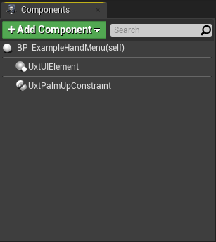
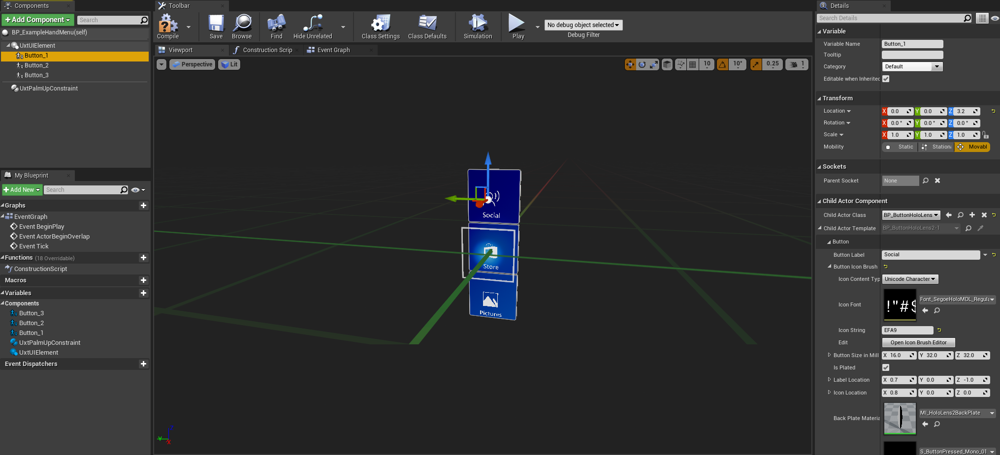
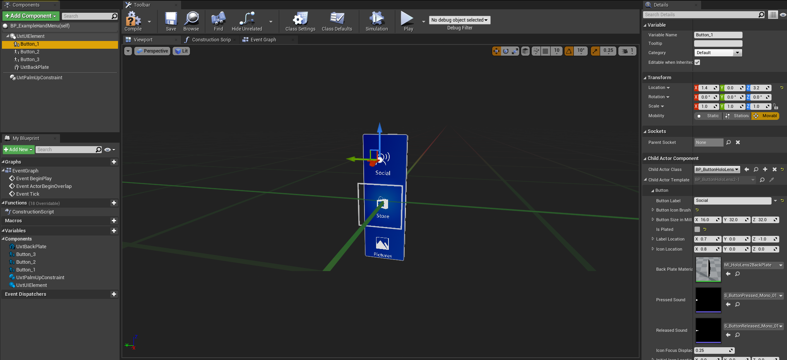
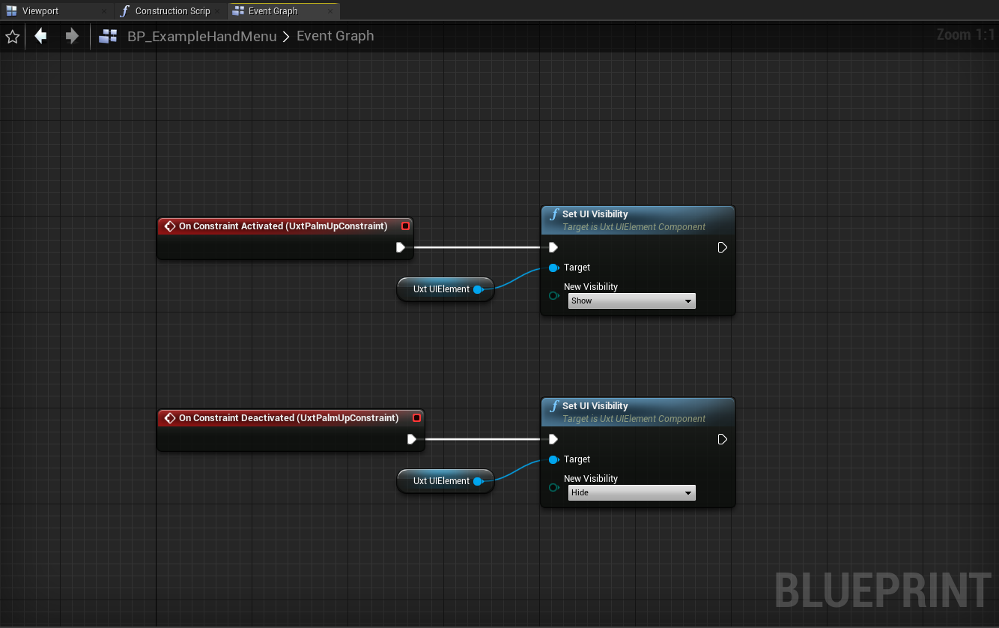
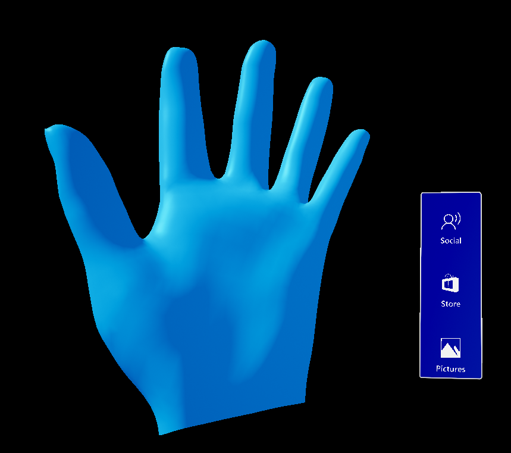

# Hand Menu

Hand menus allow users to quickly bring up hand-attached UI for frequently used functions. To prevent false activation while interacting with other objects, hand menu provides options such as 'Require Flat Hand'. It is recommended to use these options to prevent unwanted activation.

There are some examples of various hand menus in `\UXToolsGame\Plugins\UXToolsExamples\Content\HandMenu\Blueprints`.

## Creating a hand menu

In this example we are going to create a basic three button hand menu, similar to `BP_SmallHandMenu` in the hand menu example scene.

1. The `UxtUIElementComponent` and the `UxtPalmUpConstraintComponent` handle the majority of the work for a simple hand menu.
    * Create a new blueprint actor, in this example we will call it `BP_ExampleHandMenu`.
    * Add a `UxtUIElementComponent` and set it as the root component for the actor.
    * Add a `UxtPalmUpConstraintComponent` and set _Require Flat Hand_ and _Require Gaze_ to true to prevent false activations.

    

2. Now that we have our foundation, we will add some buttons to the menu.
    * Add three `ChildActorComponent`s to the blueprint, and set their child actor class to `UxtPressableButtonActor`.
    * Move one button above and another below the center button. This will be a Z value of 3.2 and -3.2.
    * Configure the buttons using the [button options](PressableButton.md#visual-configuration) in the child actor template.

    

3. Next we want to give the buttons a seamless backplate.
    * Add a `UxtBackPlateComponent` and set its material to `MI_HoloLens2BackPlate`.
    * Set the back plate's scale to 9.6 on the Z axis to make it three buttons tall.
    * Un-check _Is Plated_ on the button actors to remove their default backplate.

    

4. Finally we want to show and hide the menu using the palm up constraint.
    * In the event graph, add the _On Constraint Activated_ and _On Constraint Deactivated_ events from the `UxtPalmUpConstraintComponent`
    * In _On Constraint Activated_, call _Set UI Visibility_ on the `UxtUIElementComponent` with a value of _Show_.
    * In _On Constraint Deactivated_, call _Set UI Visibility_ on the `UxtUIElementComponent` with a value of _Hide_.
    * You can configure how far the menu will sit from the hand with the _Goal Margin_ property on the `UxtPalmUpConstraintComponent`, for this example it is set to 3.6.
    * Set the _UI Visibility_ property on the `UxtUIElementComponent` to _Hide_ to hide the menu by default.

    

5. To test out the menu in editor, press the _Home_ key while moving a hand to put it in the flat palm pose and move the hand towards the center of the screen to trigger the gaze requirement.

    

## More information

* [UxtUIElementComponent](UIElements.md)
* [UxtPalmUpConstraintComponent](PalmUpConstraintComponent.md)
* [UxtPressableButtonComponent](PressableButton.md)
