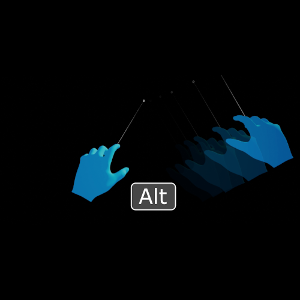
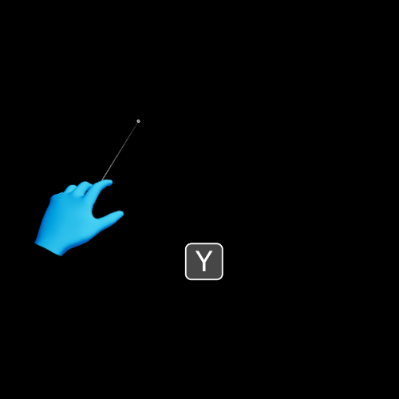
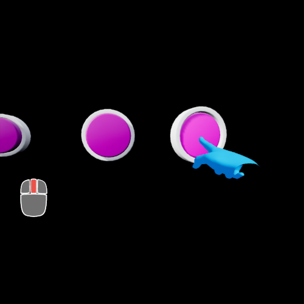

# Input Simulation

> [!CAUTION]
> If you're new to MRTK or Mixed Reality development in Unreal, we recommend starting at the beginning of our [Unreal development journey](https://docs.microsoft.com/windows/mixed-reality/unreal-development-overview), which was specifically created to walk you through installation, core concepts, and usage.

Input simulation is using mouse and keyboard input in the editor to simulate a Head-Mounted Display (HMD) as well as
hand tracking and other features. This allows testing Mixed-Reality features, such as buttons and interactions, without
a physical device.

Input simulation is not intended as a long term substitute for actual hardware, but as a development tool to improve
iteration times and allow testing in case of limited hardware availability. Input simulation is only enabled in the
Unreal editor.

## Activation

Input simulation will become active when playing in the Unreal editor and no head-mounted display (HMD) is connected. If a HMD is connected the input simulation is disabled and camera placement is controlled by the device.

## Controls

Default controls for moving the camera are based on the DefaultPawn:
* W/S keys for moving forward/backward
* A/D keys for moving sideways
* Q/E keys for moving down/up
* Mouse movement controls head rotation

In addition to default pawn movement there are virtual hands that can be controlled for simulating hand tracking:
* Hold Left Shift/Alt for controlling the left/right hand respectively.

  This disables head rotation with the mouse and moves the hand instead. Both hands can be controlled together by holding both control keys.

  
  
* T/Y keys for toggling hand visibility.

  UX Tools project settings contain an option to "Start with Hands Enabled". Hands can still be enabled with the T/Y keys even if they are not initially visible.

  
  
* Press the Left mouse button to perform a "Pinch" gesture. This also activates the "grasp" state of the hand controller, allowing object manipulation.

  
* Press the Middle mouse button to perform a "Poke" gesture. This can be used for poking buttons.

  Note that buttons can also be pressed by simply moving the hand towards the button, without performing any gestures.

  
* Holding the Right mouse button enables rotation of the controlled hands:
    * X axis changes yaw angle.
    * Y axis changes pitch angle.
    * Scroll wheel changes roll angle.

  To reset the hand rotation press the visibility keys (T/Y) twice. This will reset the hand location and rotation to defaults.

  
* While holding Left Shift/Alt, press the Home key to perform a menu gesture, with a flat palm facing up.
  This is a quick way to open a hand menu without rotating the hand. Pressing the Home key again or a mouse button changes the pose back to default.

  

## Hand Animation

Hand input is simulated with skeletal meshes that are animated according to user input.

1. The main input simulation actor adds two instances of the skeletal hand mesh for the left and right hand
  respectively. The mesh asset is expected to model the right hand, while the left hand mesh is mirrored on the Y axis.
1. An animation blueprint is used to toggle between different possible hand poses, such as a default relaxed hand, poking
  with the index finger, or pinching between thumb and index finger. Changing the current pose is bound to user input,
  usually the left and middle mouse buttons. The animation blueprint handles transition and blending between poses.
1. After the mesh animation, the input simulation actor reads the position and rotation of bones matching the relevant
  hand joints by name (see EWMRHandKeypoint enum). This data is then passed to the input simulation subsystem to emulate
  device data when requested.

### Updating Hand Animation Assets

1. The hand animation is best created from an FBX file. The file should contain:
   * A mesh model for the right hand.
   * A skeleton that animates the mesh.
   * Bones in the skeleton that match the EWMRHandKeypoint enum by name: Palm, Wrist, ThumbMetacarpal, ThumbProximal,
     ThumbDistal, ThumbTip, IndexMetacarpal, etc..

     Note that these bones do not necessarily have to deform the mesh, they only define the simulated joint positions.
     However, the joint bones should be aligned with the visible mesh to avoid confusion.
   * Animation poses for the relevant hand gestures: Flat, Relaxed, Poke, Pinch, Grab, PalmUp, etc.
1. The FBX file is imported, generating a mesh, skeleton, material(s), and animation assets.
1. Open the hand animation asset that contains the desired hand poses. With `Create Asset > Create PoseAsset > Current
    Animation` create a pose asset that can blend between the various hand poses.
1. Open the new pose asset and rename the relevant poses with meaningful names, e.g. "Flat", "Relaxed", "Pinch", "Poke".
1. Open the `InputSimulationHands_AnimInstance` asset. This is the animation blueprint that drives the skeletal
    animation. In the AnimGraph find the PoseAsset blend node and in the Details panel change the linked pose asset to the one
    created above.