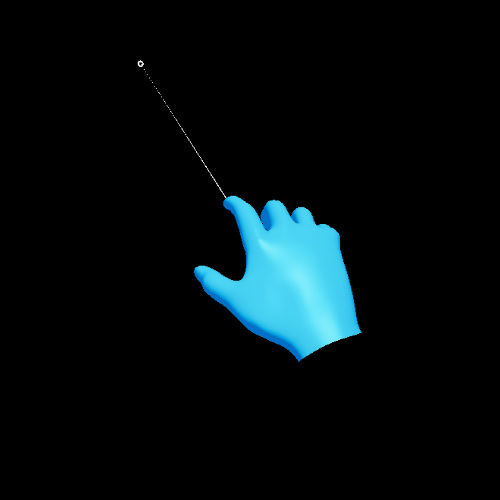

# Palm-Up Constraint Component

[Hand constraint](HandConstraintComponent.md) specialization that activates only when the palm is facing the player.

## Usage

Create a PalmUpConstraintComponent on an Actor. See Hand constraint documentation for common settings.

The Palm-Up constraint will activate when the palm normal is within a cone of size _Max Palm Angle_ of the camera direction.

### Optional conditions

- **Require Flat Hand**: Requires the user to have their hand flat for the constraint to activate. Flatness is approximated by checking the triangle between palm, index finger tip and ring finger tip. If the triangle aligns to the palm within the _Max Flat Hand Angle_ the hand is considered flat.
- **Require Gaze**: Requires the user to be looking at their hand for the constraint to activate. This will use eye gaze by default but will fall back to head gaze if no eye tracker is available. The activation area will shift towards the Hand Constraint's zone:
  - **Ulnar Side**: The activation area shifts to the little finger metacarpal joint.
  - **Radial Side**: The activation area shifts to between the index finger metacarpal and the thumb proximal joints.
  - **Above Finger Tips**: The activation area shifts to between the middle finger tip and the ring finger tip joints.
  - **Below Wrist**: The activation area shifts to the wrist joint.
