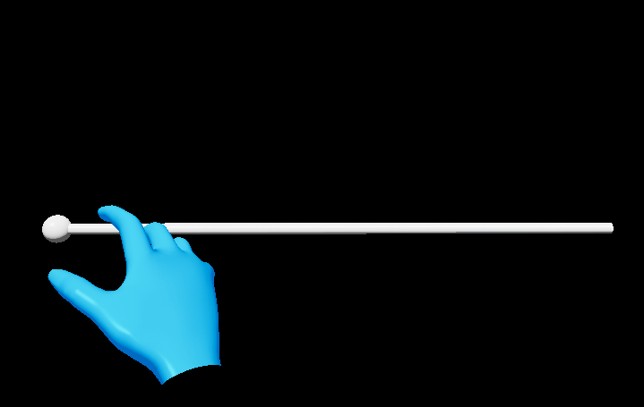

# Pinch slider

A pinch slider component allows the user to continuously change a value by moving the slider thumb along a track.

## Creating a pinch slider from scratch

1. Create a new actor blueprint with a [`UxtPinchSliderComponent`](xref:_u_uxt_pinch_slider_component) as the root component of the actor.

2. Add a Sphere static mesh to the actor and call it _Thumb_. Set its scale to _0.025_.

3. Select the UxtPinchSliderComponent and set the _Visuals_ property to reference the sphere mesh.

4. Add a Cylinder static mesh to the actor and call it _Track_. Set its scale to _(0.01, 0.01, 0.5)_ and its X rotation to _90_ degrees.

5. If the slider is configured correctly it will look like this:

## Events

Although the slider created above is behaving correctly, it's not doing anything useful. The `UxtPinchSliderComponent` has a number of events that can be used to respond to slider input:

- **OnUpdateState**: Event raised when slider changes state.
- **OnBeginFocus**: Event raised when a pointer starts focusing the slider.
- **OnUpdateFocus**: Event raised when a focusing pointer updates.
- **OnEndFocus**: Event raised when a pointer stops focusing the slider.
- **OnBeginGrab**: Event raised when slider is grabbed.
- **OnUpdateValue**: Event raised when slider's value changes.
- **OnEndGrab**: Event raised when slider is released.
- **OnEnable**: Event raised when slider is enabled.
- **OnDisable**: Event raised when slider is disabled.

## HoloLens 2 Pinch Slider

UXTools provides a ready to use HoloLens 2 style pinch slider called the `UxtPinchSliderActor`.

This slider can be configured and extended using Blueprints or C++. There is an example of this in `BP_HandMenuSlider` that can be found in the hand menu example scene.

