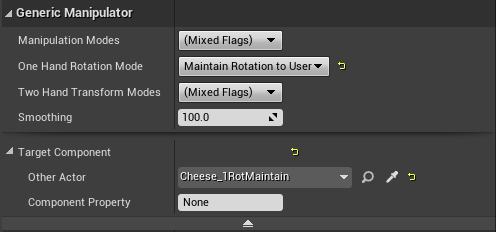
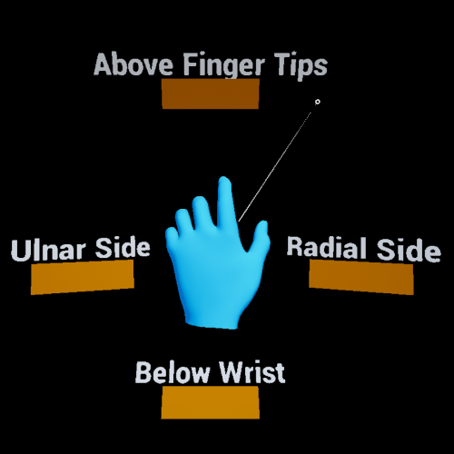

# UX Tools 0.9.0 release notes

- [What's new](#whats-new)
- [Breaking changes](#breaking-changes)
- [Known issues](#known-issues)

This release of the UX Tools supports only HoloLens 2. Support for other MR platforms remains a goal for us but is not the current focus.

Unreal 4.25 required.

## What's new

### HoloLens 2 style buttons

Expanding on our previous [pressable button](PressableButton.md) work, the toolkit now provides blueprints that mimic HoloLens 2 button visuals and behaviors. The goal of the `BP_ButtonHoloLens2` blueprint is to be easily configurable via the details panel. For examples please see the `ButtonExample` level.

A handful of derived `BP_ButtonHoloLens2` blueprints exist to exhibit behavior not found on a typical pressable button. These variants include:

- `BP_ButtonHoloLens2Toggle`, which displays an additional back plate based on the button's toggle state.

- `BP_ButtonHoloLens2ToggleCheck`, which displays a check box icon based on the button's toggle state.

- `BP_ButtonHoloLens2ToggleSwitch`, which displays a switch icon based on the button's toggle state.

### Pinch slider

We're increasing our collection of UX controls with another classic: the [slider](PinchSlider.md). We now provide a low level component to construct your own sliders with support for both far and near interaction. There's also a simple, customizable slider blueprint for out-of-the-box use.

### Improved far beam visuals

The visuals for the [far beam](FarBeam.md) displayed when in far interaction mode now match closely the ones in the HoloLens 2 Shell. The beam is dashed and fades out away from the end points to be less intrusive by default and becomes solid and bends while dragging to give a better sense of physical connection.

### Generic manipulator improvements

#### Custom manipulation targets
The `UUxtGenericManipulatorComponent` now allows you to target any `SceneComponent` as the subject for the manipulation. You can find this in the advanced properties for the Generic Manipulator.

#### Interaction mode toggle
You can now find an _Interaction Mode_ setting in the `UUxtGenericManipulatorComponent` that allows you to toggle far or near interaction with the object.

#### Constraint system
`UUxtGenericManipulatorComponent` now comes with a constraint system that allows for more flexible usage of translation, rotation and scale constraints. In this version we've added `UUxtMoveAxisConstraint` for constraining movement along a certain axis while interacting with an object. There's going to be a variety of other constraints in future releases.

#### Manipulation flags modifiable in Blueprints
Flags used by `UUxtGenericManipulatorComponent`, like Manipulation or Interaction Mode can now be used and set as Bitflags in Blueprints.

### Performant shaders and material functions

New shaders and rendering techniques were added to implement [Fluent Design System](https://www.microsoft.com/design/fluent) principles, and remain performant on Mixed Reality devices. Please see the [graphics documentation](Graphics.md) for more information.

### New editor utility Blueprints and widgets

Editor tools were created to make it easier to configure and align UX controls. For more details see the [utilities documentation](Utilities.md).

### Configurable front face fraction for buttons

Similar to the existing pressed and released fractions on the pressable button, the new `FrontFaceCollisionFraction` can be used to move the pokable button volume some fraction of the max push distance in front of the visuals front face.

### Hand constraints

Actors can now be made to follow hands by adding this constraint component. The actor will be placed next to the hand without overlapping it. See [documentation](HandConstraintComponent.md) for details.

The _Palm-Up_ constraint is an extended constraint which becomes enabled when the hand is facing the user. This is particularly useful for hand menus. See [documentation](PalmUpConstraintComponent.md) for details.

### New touchable volume component

Component that emits focus and poke events like the Pressable Button, but uses arbitrary touchable volumes. A primitive component must be added to the same actor. Events can be used in blueprints to react to user interaction.

### Forced grab cancelation

Grab target interactions can now be force-cancelled by calling the _ForceEndGrab_ function.

## Breaking changes

### PushBehaviour and MaxPushDistance made private in pressable button component

`UUxtPressableButtonComponent::PushBehavior` and `UUxtPressableButtonComponent::MaxPushDistance` have been moved to private to enforce `MaxPushDistance` constraints with compressible buttons (MaxPushDistance is auto calculated for buttons with a compress push behavior). Please use the associated getters/setters from now on.

### Button states

`UUxtPressableButtonComponent`'s `IsFocused()`, `IsPressed()` and `IsDisabled()` have been have been removed in favor of `GetState()`. These don't map 1:1, as before it was possible for `IsFocused()` and `IsPressed()` to be true simultaneously. `GetState()` will only give you the primary state of the button (e.g. Pressed). You can track the sub-states of the button using the begin/end events triggered by the button or combinations of overall states.

### Add option to switch between local and world space for button distances

MaxPushDistance is now in button local space. There are two ways of fixing this if you wish the button planes to remain in the same positions in space as they were before updating uxt:
  1. If you want button distances in world space, record the value of _Max Push Distance_, switch the button property _Use Absolute Push Distance_ to true and set _Max Push Distance_ to the old value.
  2. If you want button distances in local space, complete step 1. and then switch the button property _Use Absolute Push Distance_ back to false. The _Max Push Distance_ will update automatically.

### Fix buttons so that they face positive X

Buttons now depress towards negative x. This means that buttons will need to be rotated in order to function properly.
  1. Open your button blueprint, if you select the pressable button component you'll notice that the button planes are now aligned with the wrong side of the button. You should see a plane drawn with a solid white line on what you used to consider the back of the button visuals.
  2. Transform your movable button visuals so that the new front face is at the same location as the old front face, except reflected on the other side of the blueprint origin. Depending on your individual case, You may not need to transform your visuals at all, you may get away with only translating or you may need to both translate and rotate your button visuals. Here's a rough visualization of this reflection:

     | Before Update | After Update | After Transform |
     | :-: | :-: | :-: |
     | • ¦ \| | • \| ¦ | \| ¦ • |

     | → Front Plane, ¦ → Back Plane, • → Blueprint Origin
  3. Translate or rotate any other parts of your button blueprint so that it works with the new button orientation and location (e.g. rotate text to face new front plane, move baseplate so that it aligns with the new back of the button).
  4. Wherever this blueprint is used (maps, other blueprints etc.) you will need to rotate the actor 180° around the z-axis.

### Rename the UxtBoundingBoxManipulatorComponent and related classes to BoundsControl

Existing assets referencing those types will have to be re-saved as the redirects for the names changes will be eventually removed. Code references to the renamed types will have to be updated.

### Shader compilation errors when ray tracing is supported

If you are running UE 4.25.0 and your computer's GPU supports ray tracing you must disable UE 4.25 ray tracing support for UXT's custom shaders to compile. To disable ray tracing navigate to C:\Program Files\Epic Games\UE_4.25\Engine\Config\Windows (or where your installation is located), open `DataDrivenPlatformInfo.ini` and change `bSupportsRayTracing=true` to `bSupportsRayTracing=false`

This setting change is not required in UE 4.25.1 (or later) or people with Epic's 13205426 changelist. This warning is also in the Getting Started portion of the README.

### Fix UxtFollowComponent to work with +X convention

`UUxtFollowComponent` now works appropriately, following (Actor's) +X convention. That means that, if an asset was rotated by 180º in any subcomponent to be displayed as expected, that should now be reverted, rotating the Actor appropriately instead.

## Known issues

### Visual glitch with BoundsControl when the affordances overlap

This can be worked around by preventing the actor from being scaled down past the point at which this occurs.

### Buttons can be pressed from behind

If you stand behind a button you can press it by moving the finger through the button and back.

### Generic manipulator

- Rotation about object center via generic manipulator should use wrist rotation.
- Not working if physics is enabled and mesh is not actor root.

