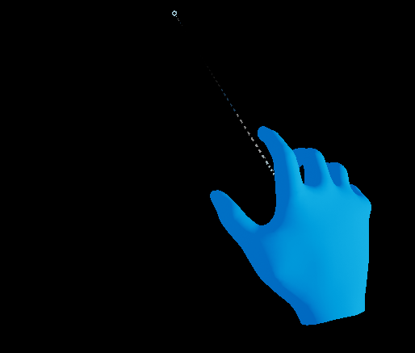
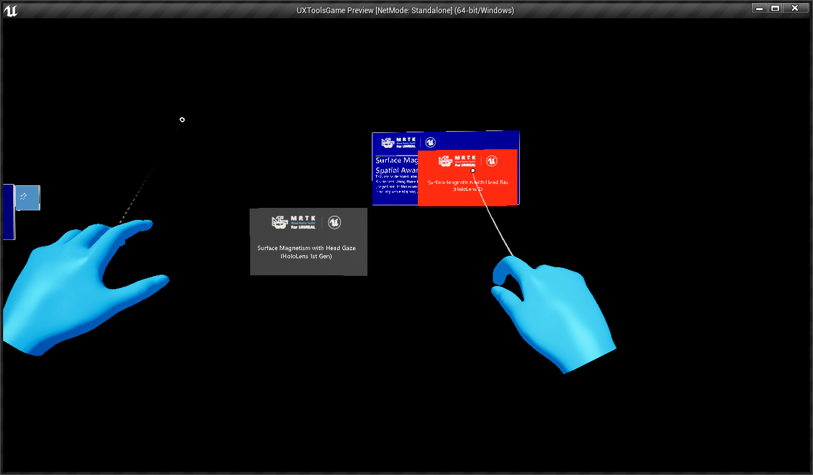
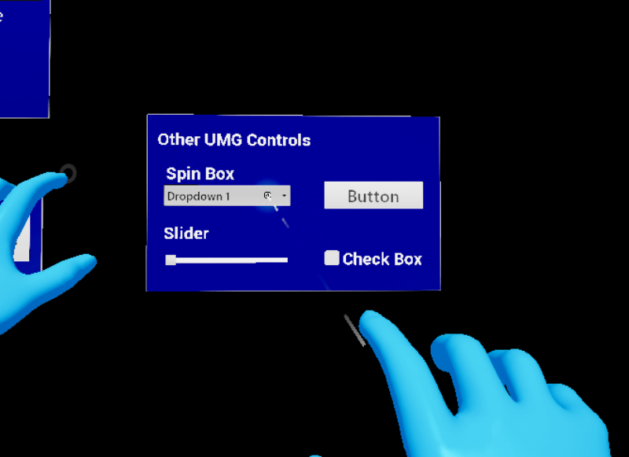

# UX Tools 0.10.0 release notes

- [What's new](#whats-new)
- [Breaking changes](#breaking-changes)

This release of the UX Tools supports only HoloLens 2. Support for other MR platforms remains a goal for us but is not the current focus.

Unreal 4.25 required.

## What's new

### UI elements

The new [`UxtUIElementComponent`](UIElements.md) allows an actor's visibility to be controlled by its parent actor, allowing for easy construction of hierarchical UIs. The hierarchies can be constructed using actor attachment or child actor components.

`UxtPressableButtonComponent`, `UxtPinchSliderComponent` and `UxtTouchableVolumeComponent` now inherit from `UxtUIElementComponent`.

### Hand menus

[Hand menus](HandMenu.md) are a convenient hand-attached UI that are great for frequently used functions. An example level has been added to demonstrate various types of hand menus and to act as a guide for building custom menus.

### Tap to Place

[Tap to place](TapToPlaceComponent.md) is a new far interaction component that can be used to easily place primitive components against surfaces. It works with collidable surfaces in the scene, as well as with the spatial mesh.

### Surface Magnetism (experimental)

This new component (far interaction only) allows an actor to stick to a surface.

It works both with other actors in the scene

as well as a spatial mesh

### Follow component

The [follow component](FollowComponent.md) now has the ability to maintain a fixed vertical distance from the camera. This can be used to prevent the actor from obstructing the user's vision.

### UMG widgets

The new [Widget component](WidgetComponent.md) allows interaction with Unreal Engine's UMG widgets.

### Visual Logging

UXTools hand interaction supports visual logging now. This is useful for debugging interactions intuitively in the editor. To enable visual logging simply follow the standard Unreal Editor instructions [here](https://docs.unrealengine.com/en-US/Gameplay/Tools/VisualLogger/index.html).

Currently supported features include:

- Basic hand tracking (joint positions and pointer pose)
- Near pointers (grab and poke)
- Far pointer
- Proximity detection (switching near vs. far)

## Breaking changes

### BP_BaseButton and derived buttons

`BP_BaseButton` and the buttons derived from it have been moved to native code.

- `BP_BaseButton` has been replaced by `AUxtBasePressableButtonActor`.
- `BP_ButtonHoloLens2` has been replaced by `AUxtPressableButtonActor`.
- `BP_ButtonHoloLens2Toggle` has been replaced by `AUxtPressableToggleButtonActor`.
- `BP_ButtonHoloLens2ToggleCheck` has been replaced by `AUxtPressableCheckButtonActor`.
- `BP_ButtonHoloLens2ToggleSwitch` has been replaced by `AUxtPressableSwitchButtonActor`.

Toggle button state and event dispatchers are now accessible through the `UUxtToggleStateComponent` instead of directly on the actor.

### BP_SimpleSlider

`BP_SimpleSlider` has been replaced by `AUxtPinchSliderActor`. It has the same feature set as `BP_SimpleSlider` and can be extended from either Blueprints or C++.

- `AUxtPinchSliderActor` now faces positive X.

### BP_TextActor

`BP_TextActor` has been replaced by `AUxtTextRenderActor`. It has the same feature set as `BP_TextActor` and can be extended from either Blueprints or C++.

### EUxtInteractionMode

`EUxtInteractionMode` has moved from `Interactions/UxtManipulationFlags.h` to `Interactions/UxtInteractionMode.h`.

### UxtBackPlateComponent

`UxtBackPlateComponents` now scale correctly when parent components are scaled. Any existing `UxtBackPlateComponents` may need to have their 'x' and 'z' scales swapped.

Unreal doesn't account for parent child rotations when applying parent child scales, so it was possible to run into situations where scaling the parent would not scale the child back plate appropriately. Before this change back plates where scaled as "_height_ x _width_ x _depth_" and are now scaled via the Unreal's traditional "_depth_ x _width_ x _height_" convention. For more information please see the [graphics documentation](Graphics.md#rounded-edge-thick).

### UxtBoundsControlComponent

The `Preset` property of the bounds control component has been replaced with a data asset, which can be more easily copied and customized by users. All six presets exist as data assets in `UXTools Content/Bounds Control/Presets`. The `Config` property on existing bounds control components may need to be updated.

- Default: corners resize bounds, edges rotate them.
- Slate2D: only has front side affordances, all of them resize bounds.
- AllResize, AllScale, AllTranslate, AllRotate: have all possible affordances with the same action, mostly for testing.

The preset assets contain a list of affordance configs, each of which consist of

- A placement enum, e.g. "Corner Front Top Left", "Edge Right Bottom".
- The action performed by the affordance (resize, scale, translate, rotate).
- Flag to toggle uniform actions, i.e. allow non-uniform scaling of the bounds.

`FUxtBoundsControlAffordanceInfo` has been replaced with `FUxtAffordanceInstance`.

- Data that was available in `FUxtBoundsControlAffordanceInfo` can be accessed through it's `Config` property.

Bounds control component now uses simple mesh assets for affordances instead of full blueprint classes. The existing static meshes from affordance BPs can continue to be used.

- If the affordances classes (e.g. `CornerAffordanceClass`) on a BoundsControlComponent have been customized then the new equivalent mesh property (e.g. `CornerAffordanceMesh`) needs to be set.

### UxtFarPointerComponent

The `UxtFarPointerComponent` now uses simple collision primitives instead of complex collision primitives for its interactions. Any objects that require the complex collision mesh be used with the far pointer should set the mesh's _Collision Complexity_ to _Use Complex Collision As Simple_ under its collision settings.

### UxtFarTarget

The interface for handling far interactions has been moved from `IUxtFarTarget` into `IUxtFarHandler`. There are three changes necessary to update classes inheriting from `IUxtFarTarget`:

- Inherit from `IUxtFarHandler` alongside `IUxtFarTarget`
- Add an implementation for `IUxtFarHandler::CanHandleFar` to the class.
- Update `IsFarFocusable` to be a `const` member function.

### UxtFollowComponent

`MoveToDefaultDistanceLerpTime` has been renamed to `LerpTime`.

### UxtGrabTarget

The interface for handling far interactions has been moved from `IUxtGrabTarget` into `IUxtGrabHandler`. There are three changes necessary to update classes inheriting from `IUxtGrabTarget`:

- Inherit from `IUxtGrabHandler` alongside `IUxtGrabTarget`
- Add an implementation for `IUxtGrabHandler::CanHandleGrab` to the class.
- Update `IsGrabFocusable` to be a `const` member function.

### UxtGrabTargetComponent

- `GetGrabPointCentroid` has been updated to return an `FTransform` instead of just a location vector.
- `GetGrabPointCentroidTransform` has been removed. Instead `GetGrabPointCentroid` can be used by passing the target component's world transform.

### UxtHandInteractionActor

`NearActivationDistance` has been removed. The proximity detection is defined by the `ProximityCone` parameters now.

### UxtNearPointerComponent

`GetFocusedGrabTarget` and `GetFocusedPokeTarget` now also return the surface normal as an output parameter.

### UxtPinchSliderComponent

The `UxtPinchSliderComponent` has been simplified and streamlined. It now operates on the same principles as the `UxtPressableButtonComponent`.

Interface changes:

- `GetCurrentState` has been renamed to `GetState`.
- `GetThumbVisuals`/`SetThumbVisuals` has been renamed to `GetVisuals`/`SetVisuals`.
- `GetSliderValue`/`SetSliderValue` have been renamed to `GetValue`/`SetValue`.
- `GetSliderLowerBound`/`SetSliderLowerBound` have been renamed to `GetValueLowerBound`/`SetValueLowerBound`.
- `GetSliderUpperBound`/`SetSliderUpperBound` have been renamed to `GetValueUpperBound`/`SetValueUpperBound`.
- `IsGrabbed`, `IsFocused` and `IsEnabled` have been removed in favor of using `GetState`.
- Any references to the track and tick mark visuals have been removed as they are now managed by `AUxtPinchSliderActor`.
- `SliderStartDistance` and `SliderEndDistance` have been replaced by a single `TrackLength` property that dictates the length of the track.

Event changes:

- `OnBeginInteraction` has been renamed to `OnBeginGrab`.
- `OnEndInteraction` has been renamed to `OnEndGrab`.
- `OnSliderEnabled` has been renamed to `OnEnable`.
- `OnSliderDisabled` has been renamed to `OnDisable`.

`EUxtSliderState` changes:

- `Focus` has been renamed to `Focused`.
- `Grab` has been renamed to `Grabbed`.

Other changes:

- The min / max positions on the slider have been swapped to make sliders face positive X.

### UxtPokeTarget

The interface for handling far interactions has been moved from `IUxtPokeTarget` into `IUxtPokeHandler`. There are three changes necessary to update classes inheriting from `IUxtPokeTarget`:

- Inherit from `IUxtPokeHandler` alongside `IUxtPokeTarget`
- Add an implementation for `IUxtPokeHandler::CanHandlePoke` to the class.
- Update `IsPokeFocusable` to be a `const` member function.
