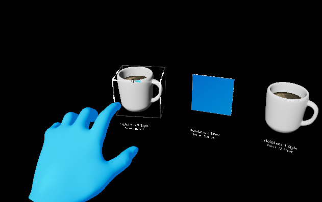
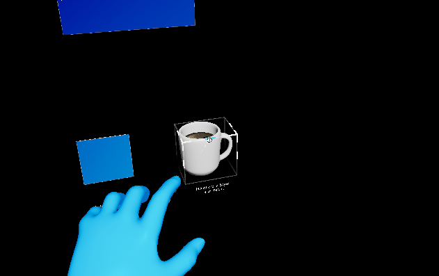

# UX Tools 0.11.0 release notes

- [What's new](#whats-new)
- [Breaking changes](#breaking-changes)
- [Known issues](#known-issues)

This release of the UX Tools supports only HoloLens 2. Support for other MR platforms remains a goal for us but is not the current focus.

Unreal 4.26 required.

## What's new

### Examples Plugin

UX Tools common content and example scenes were moved to a separate plugin to make it easier to incorporate them
as a starting point for new projects.

### UxtPalmUpConstraintComponent

The palm-up constraint has gained the _Require Gaze_ option to ensure the user is deliberately trying to use the constraint and help prevent false activations. This is particularly useful for world-locking hand menus as it prevents the menu from unintentionally re-attaching to the hand.

### UxtPinchSliderActor

The pinch slider actor has gained a number of quality of life improvements. These include:

- Customizable minimum / maximum values.
- GetValue, SetValue and OnSliderUpdateValue exposed directly on the actor to allow easy access to the slider's value relative to the custom min / max value. (note: if using the underlying `UxtPinchSliderComponent`, it's value will still be in the range 0-1)
- Stepped movement along the slider's tick marks.

### UxtPinchSliderComponent

The pinch slider component now has the option to use stepped movement. This can be configured in the advanced settings for the component.

### UxtBoundsControlComponent

#### Rewrite

In order to simplify the `UUxtBoundsControlComponent`, besides reducing the number of edge cases and better aligning with its MRTK-Unity's counterpart:

- `UUxtBoundsControlComponent` now allows constraints' configuration via the same mechanism as the _Manipulators_. This means that the same `UUxtTransformConstraint`-derived constraints can be used with bounds-controlled objects.
- `UUxtBoundsControlConfig` data assets are simplified, so they don't need to specify what each affordance does separately. Now corners scale, edges rotate and faces/center translate.

Here is an example of what happened before when locking the Z axis:

Now, however, adding a `UxtRotationAxisConstraint` configured to constrain the Z axis (using local actor's space) is more intuitive:

#### Uniform scaling bug

Even if ticking the box to use uniform scaling, actor's proportions were modified. This has been fixed and now works properly:

Before:

Now:

### UxtMinMaxScaleConstraint

A new constraint to limit the minimum and maximum scale of an actor has been implemented.

### UxtRotationAxisConstraint

We have improved this constraint's implementation by avoiding conversion to euler angles to appropriately integrate with `UxtBoundsControlComponent`, since we discovered certain weird rotations with the previous algorithm.

### Improved editor categories

We have reworked the editor categories used by UX Tools to produce a more clear, simple and consistent interface.

## Breaking changes

### UxtGenericManipulatorComponent

The _Target Component_ now uses a component picker to select its target. Due to this, the generic manipulator can no longer target components on other actors when being configured from the editor.

The _ManipulationModes_ setting on the generic manipulator has been moved up the hierarchy to the `UxtGrabTargetComponent` and renamed to _GrabModes_. Its associated enum has been renamed to `EUxtGrabMode`.
This change means that the `UxtGrabTargetComponent` will now respond to its _GrabModes_ and will only trigger grab/release events when its grab mode has been satisfied. (e.g. when using only two handed grabs, a grab event is only triggered when both hands are grabbing the object)

### UxtGrabTargetComponent

The `UxtGrabTargetComponent` has been converted from a `SceneComponent` to an `ActorComponent`. This affects the classes derived from `UxtGrabTargetComponent` such as the `UxtManipulatorComponentBase` and the `UxtGenericManipulatorComponent`.
Most blueprints will continue to work with no issues but any blueprints that access one of these components as a variable will need to have the component removed and re-added for them to compile.

### UxtHandConstraintComponent

`UUxtHandConstraintComponent::IsHandUsableForConstraint()` is now a non-const member function.

### UxtPinchSliderActor

As part of adding a customizable minimum / maximum slider value, the _InitialValue_ property has been replaced with a _Value_ property. As part of this change, the `GetInitialValue()` and `SetInitialValue(...)` functions on the `UxtPinchSliderActor` are now called `GetValue()` and `SetValue(...)`.

Previous settings can be easily carried forward:

1. Add `+PropertyRedirects=(OldName="UxtPinchSliderActor.InitialValue", NewName="UxtPinchSliderActor.Value")` to _DefaultUXTools.ini_. (found in the plugin's configuration folder)
2. Re-save any levels with sliders to update their properties.
3. Remove the property redirect from _DefaultUXTools.ini_.

### UxtTransformConstraint

The `UxtTransformConstraint` has been converted from a `SceneComponent` to an `ActorComponent`. This affects the classes derived from `UxtTransformConstraint` such as the `UxtFaceUserConstraint`, the `UxtFixedDistanceConstraint`, the `UxtFixedRotationToUserConstraint`, the `UxtFixedRotationToWorldConstraint`, the `UxtMaintainApparentSizeConstraint`, the `UxtMoveAxisConstraint` and the `UxtRotationAxisConstraint`.
Most blueprints will continue to work with no issues but any blueprints that access one of these components as a variable will need to have the component removed and re-added for them to compile.

### UxtBoundsControlComponent

Configuring each affordance's action separately is no longer allowed so, if any feature relied on that, an extension to the `UUxtBoundsControlComponent` should be implemented instead. Besides that, the `EUxtAffordanceAction::Resize` has been removed, so only `EUxtAffordanceAction::Scale` (action of corner affordances) can scale the object in the direction that the grabbed affordance is on, leaving the opposite affordance pinned to its location at the start of the interaction.

_Locked Axes_ property in `UUxtBoundsControlConfig` data assets no longer exists. Therefore, if you were using the _Locked Axes_ flags to constrain movement or rotation of an object, you should now add the appropriate `UUxtMoveAxisConstraint` or `UUxtRotationAxisConstraint` (respectively) instead.

The _MinimumBoundsScale_ and _MaximumBoundsScale_ properties have been removed in favor of using the `UxtMinMaxScaleConstraint` for controlling this behavior.

## Known issues

### UxtGenericManipulatorComponent

When the target component's rotation does not match its parent actor's rotation, the parent actors rotation will be applied to the target component when manipulation is started.
