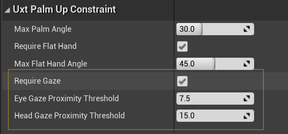
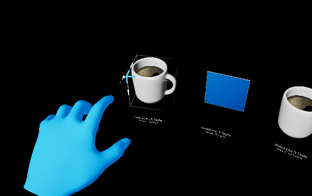
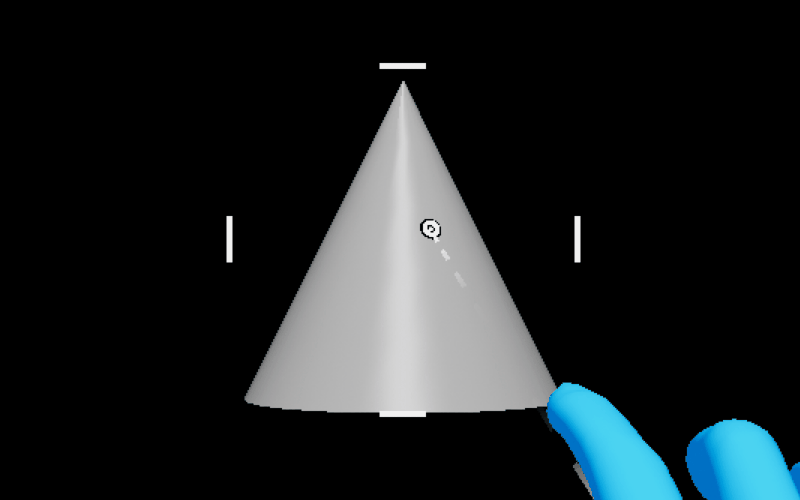
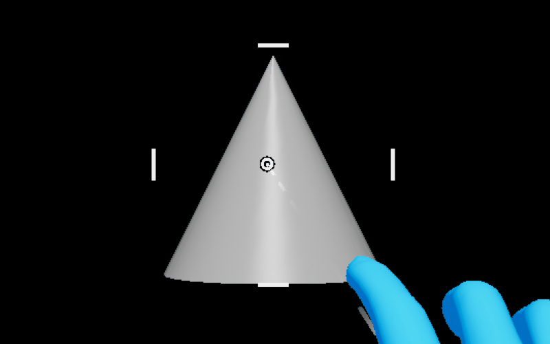
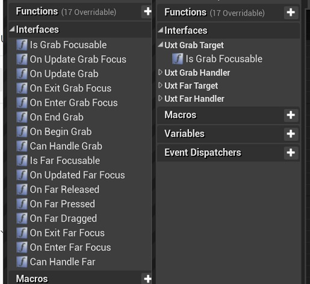

# UX Tools 0.11.0 release notes

- [What's new](#whats-new)
- [Breaking changes](#breaking-changes)
- [Known issues](#known-issues)
- [Full change list](#full-change-list)

This release of the UX Tools supports only HoloLens 2. Support for other MR platforms remains a goal for us and we are hoping to be able to deliver it in the near future.

Unreal 4.26 required.

## What's new

These are some of this release's highlights. For a more comprehensive list of changes see the [full change list](#full-change-list).

### Examples plugin

UX Tools example scenes have been moved to a separate plugin to make it easier to incorporate them
as a starting point for new projects.

### Improved hand menu activation using user gaze

The palm-up constraint has gained the _Require Gaze_ option to ensure the user is deliberately trying to use the constraint and help prevent false activations. This is particularly useful for world-locking hand menus as it prevents the menu from unintentionally re-attaching to the hand.

### Pinch slider improvements

The pinch slider actor has gained a number of quality of life improvements. These include:

- Customizable minimum / maximum values.
- GetValue, SetValue and OnSliderUpdateValue exposed directly on the actor to allow easy access to the slider's value relative to the custom min / max value. (note: if using the underlying `UxtPinchSliderComponent`, it's value will still be in the range 0-1)
- Stepped movement along the slider's tick marks.

### Bounds control improvements

#### Constraint support

Manipulation constraints (i.e. derived from `UUxtTransformConstraint`) now also apply to manipulations performed via [bounds control](BoundsControl.md), making it easier to produce a consistent behavior when manipulating transforms.

#### Uniform scaling

 _Uniform scaling_ now works as expected.

| Before | After |
| --- | --- |
|  |  |

#### Improved affordance selection via hand ray

Previously, bounding box affordances were only revealed when hovering directly over them or over the bounding box contents. This could make them difficult to select if the bounding box was not a tight fit. We now also reveal affordances when the ray hovers the box itself.

| Before | After |
| --- | --- |
|  |  |

### New scale constraint

A new constraint (`UxtMinMaxScaleConstraint`) to limit how much an actor can be scaled down or up via bounds control and manipulation components.

### Improved editor categories

We have reworked the editor categories used by UX Tools to produce a more clear, simple and consistent interface.

## Breaking changes

### UxtGenericManipulatorComponent

The _Target Component_ now uses a component picker to select its target. Due to this, the generic manipulator can no longer target components on other actors when being configured from the editor.

The _ManipulationModes_ setting on the generic manipulator has been moved up the hierarchy to the `UxtGrabTargetComponent` and renamed to _GrabModes_. Its associated enum has been renamed to `EUxtGrabMode`.
This change means that the `UxtGrabTargetComponent` will now respond to its _GrabModes_ and will only trigger grab/release events when its grab mode has been satisfied. (e.g. when using only two handed grabs, a grab event is only triggered when both hands are grabbing the object)

### UxtGrabTargetComponent

The `UxtGrabTargetComponent` has been converted from a `SceneComponent` to an `ActorComponent`. This affects the classes derived from `UxtGrabTargetComponent` such as the `UxtManipulatorComponentBase` and the `UxtGenericManipulatorComponent`.
Most blueprints will continue to work with no issues but any blueprints that access one of these components as a variable will need to have the component removed and re-added for them to compile.

### UxtHandConstraintComponent

`UUxtHandConstraintComponent::IsHandUsableForConstraint()` is now a non-const member function.

### UxtPinchSliderActor

As part of adding a customizable minimum / maximum slider value, the _InitialValue_ property has been replaced with a _Value_ property. As part of this change, the `GetInitialValue()` and `SetInitialValue(...)` functions on the `UxtPinchSliderActor` are now called `GetValue()` and `SetValue(...)`.

Previous settings can be easily carried forward:

1. Add `+PropertyRedirects=(OldName="UxtPinchSliderActor.InitialValue", NewName="UxtPinchSliderActor.Value")` to _DefaultUXTools.ini_. (found in the plugin's configuration folder)
2. Re-save any levels with sliders to update their properties.
3. Remove the property redirect from _DefaultUXTools.ini_.

### UxtTransformConstraint

The `UxtTransformConstraint` has been converted from a `SceneComponent` to an `ActorComponent`. This affects the classes derived from `UxtTransformConstraint` such as the `UxtFaceUserConstraint`, the `UxtFixedDistanceConstraint`, the `UxtFixedRotationToUserConstraint`, the `UxtFixedRotationToWorldConstraint`, the `UxtMaintainApparentSizeConstraint`, the `UxtMoveAxisConstraint` and the `UxtRotationAxisConstraint`.
Most blueprints will continue to work with no issues but any blueprints that access one of these components as a variable will need to have the component removed and re-added for them to compile.

### UxtBoundsControlComponent

Configuring each affordance's action separately is no longer allowed so, if any feature relied on that, an extension to the `UUxtBoundsControlComponent` should be implemented instead. Besides that, the `EUxtAffordanceAction::Resize` has been removed, so only `EUxtAffordanceAction::Scale` (action of corner affordances) can scale the object in the direction that the grabbed affordance is on, leaving the opposite affordance pinned to its location at the start of the interaction.

_Locked Axes_ property in `UUxtBoundsControlConfig` data assets no longer exists. Therefore, if you were using the _Locked Axes_ flags to constrain movement or rotation of an object, you should now add the appropriate `UUxtMoveAxisConstraint` or `UUxtRotationAxisConstraint` (respectively) instead.

The _MinimumBoundsScale_ and _MaximumBoundsScale_ properties have been removed in favor of using the `UxtMinMaxScaleConstraint` for controlling this behavior.

## Known issues

### UxtGenericManipulatorComponent

When the target component's rotation does not match its parent actor's rotation, the parent actors rotation will be applied to the target component when manipulation is started.

## Full change list

| Commit | Description |
| --- | --- |
| [1648ad01](https://github.com/microsoft/MixedReality-UXTools-Unreal/commit/1648ad01) | Add examples as dependency |
| [12e0c5a2](https://github.com/microsoft/MixedReality-UXTools-Unreal/commit/12e0c5a2) | Roll back rotation constraint's modifications |
| [253d2b9f](https://github.com/microsoft/MixedReality-UXTools-Unreal/commit/253d2b9f) | Add enabled UXTools plugin to .uproject |
| [a9cd53ce](https://github.com/microsoft/MixedReality-UXTools-Unreal/commit/a9cd53ce) | Fix spaces in some categories |
| [bda99d59](https://github.com/microsoft/MixedReality-UXTools-Unreal/commit/bda99d59) | Improve descriptions and labels in example scenes |
| [db6127f6](https://github.com/microsoft/MixedReality-UXTools-Unreal/commit/db6127f6) | Refactor to make scale constraint easier |
| [e44c7782](https://github.com/microsoft/MixedReality-UXTools-Unreal/commit/e44c7782) | Improve Bounds Control and constraints' docs |
| [f0199b94](https://github.com/microsoft/MixedReality-UXTools-Unreal/commit/f0199b94) | Fix level change crash |
| [3384b9d1](https://github.com/microsoft/MixedReality-UXTools-Unreal/commit/3384b9d1) | Remove AR Session workaround for MobilePreview |
| [0acbbad0](https://github.com/microsoft/MixedReality-UXTools-Unreal/commit/0acbbad0) | Refactor/normalize all categories |
| [1c77f51b](https://github.com/microsoft/MixedReality-UXTools-Unreal/commit/1c77f51b) | Stepped slider gif + heading fixups |
| [9f29c2ab](https://github.com/microsoft/MixedReality-UXTools-Unreal/commit/9f29c2ab) | Disabling unfinished "Mask Logic" in Scrolling Object Collection |
| [e42416f7](https://github.com/microsoft/MixedReality-UXTools-Unreal/commit/e42416f7) | Moving Home Button to "On Release" |
| [1b7a5a09](https://github.com/microsoft/MixedReality-UXTools-Unreal/commit/1b7a5a09) | Clarify breaking changes after testing upgrade from 0.10 |
| [70adb554](https://github.com/microsoft/MixedReality-UXTools-Unreal/commit/70adb554) | Update CI editor version to 4.26.0 (release) |
| [ce9742c7](https://github.com/microsoft/MixedReality-UXTools-Unreal/commit/ce9742c7) | Adding plugin images. |
| [2a0a5fb5](https://github.com/microsoft/MixedReality-UXTools-Unreal/commit/2a0a5fb5) | Implement min/max scale constraint |
| [d32355c3](https://github.com/microsoft/MixedReality-UXTools-Unreal/commit/d32355c3) | Rewrite bounds control and fix rotation constraint |
| [099b6115](https://github.com/microsoft/MixedReality-UXTools-Unreal/commit/099b6115) | Add collision box to BoundsControlComponent |
| [7f58f198](https://github.com/microsoft/MixedReality-UXTools-Unreal/commit/7f58f198) | Update version to 0.11.0 |
| [2afc85b1](https://github.com/microsoft/MixedReality-UXTools-Unreal/commit/2afc85b1) | Fixing invalid enum value metadata tags from UxtScrollingObjectCollection |
| [692c3365](https://github.com/microsoft/MixedReality-UXTools-Unreal/commit/692c3365) | Fix one handed only manipulation not responding if grabbed by both hands |
| [f6588058](https://github.com/microsoft/MixedReality-UXTools-Unreal/commit/f6588058) | Update UXTools to UE4.26 |
| [0c4ccdcf](https://github.com/microsoft/MixedReality-UXTools-Unreal/commit/0c4ccdcf) | Manipulator improvements |
| [50a77125](https://github.com/microsoft/MixedReality-UXTools-Unreal/commit/50a77125) | Add include to fix CI build |
| [c8da2565](https://github.com/microsoft/MixedReality-UXTools-Unreal/commit/c8da2565) | Display current git commit in the Loader scene (packaged game only) |
| [d2a184e0](https://github.com/microsoft/MixedReality-UXTools-Unreal/commit/d2a184e0) | Add gaze requirement to PalmUpConstraint and Hand Menu |
| [fe8e77aa](https://github.com/microsoft/MixedReality-UXTools-Unreal/commit/fe8e77aa) | Update docs with information about Examples plugin |
| [e7c91b2f](https://github.com/microsoft/MixedReality-UXTools-Unreal/commit/e7c91b2f) | Use 2D corner handle on Slate2D example bounds control |
| [c0947793](https://github.com/microsoft/MixedReality-UXTools-Unreal/commit/c0947793) | Enable eye tracking in UXToolsGame package |
| [01562b9c](https://github.com/microsoft/MixedReality-UXTools-Unreal/commit/01562b9c) | Slider improvements |
| [d5271e7c](https://github.com/microsoft/MixedReality-UXTools-Unreal/commit/d5271e7c) | Update editor version to 4.25.4 |
| [c31e8318](https://github.com/microsoft/MixedReality-UXTools-Unreal/commit/c31e8318) | Move Examples into a separate plugin |
| [3b6173fe](https://github.com/microsoft/MixedReality-UXTools-Unreal/commit/3b6173fe) | Cook Warning Fixes |
| [0b84cca9](https://github.com/microsoft/MixedReality-UXTools-Unreal/commit/0b84cca9) | Enable debug info in CI package and add symbols to artifact |
| [eda87709](https://github.com/microsoft/MixedReality-UXTools-Unreal/commit/eda87709) | Export all public interfaces |
| [e62fbc89](https://github.com/microsoft/MixedReality-UXTools-Unreal/commit/e62fbc89) | Removing all built data and changing levels to not generate static lighting data. |
| [6ad0acf8](https://github.com/microsoft/MixedReality-UXTools-Unreal/commit/6ad0acf8) | Introduce roll for vertical normals |