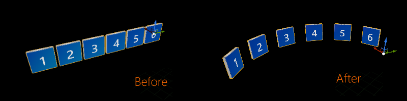

# UX Tools 0.13.0 release notes

- [What's new](#whats-new)
  - [Graduation of the scrolling object collection from experimental](#graduation-of-the-scrolling-object-collection-from-experimental)
  - [Re-parented UxtBoundsControl's affordances](#re-parented-uxtboundscontrols-affordances)
  - [Create UxtBoundsControl's bounding box automatically](#create-uxtboundscontrols-bounding-box-automatically)
  - [Align actors on arc](#align-actors-on-arc)
  - [TapToPlace improvements](#taptoplace-improvements)
- [Breaking changes](#breaking-changes)
  - [UxtBoundsControl](#uxtboundscontrol)
    - [Affordances re-parenting](#affordances-re-parenting)
    - [Bounding box created automatically](#bounding-box-created-automatically)
  - [UUxtMathUtilsFunctionLibrary](#uuxtmathutilsfunctionlibrary)
    - [CalculateHierarchyBounds returns component bounds even if no filter was provided](#calculatehierarchybounds-returns-component-bounds-even-if-no-filter-was-provided)
- [Full change list](#full-change-list)

This release of the UX Tools has been tested on HoloLens 2 and Windows Mixed Reality VR but should work on all [XR devices supported by Unreal Engine via OpenXR](https://docs.unrealengine.com/en-US/SharingAndReleasing/XRDevelopment/OpenXR/#platformsupport):
- HoloLens 2
- Windows Mixed Reality VR
- Oculus
- Steam VR

Unreal 4.27 required.

## What's new

These are some of this release's highlights. For a more comprehensive list of changes see the [full change list](#full-change-list).

### Graduation of the scrolling object collection from experimental

The scrolling object collection has been updated and is no longer tagged as experimental. The component now supports per-pixel item clipping, compound item input routing, and a handful of bugs and quality of life issues have been addressed. Check out the [new documentation](ScrollingObjectCollection.md) and example level to learn more.

### Re-parented UxtBoundsControl's affordances

**Uxt Bounds Control** places its associated affordances and box collider in an actor that it creates on **Begin Play**. This external actor used to be un-parented and required its transform (and those of the affordances) to be recalculated explicitly every frame. Now, the external actor is parented to the one that owns the **Uxt Bounds Control** component and it leverages the `TransformUpdated` event instead of the tick function, so it only recalculates the scale of the affordances when necessary.

### Create UxtBoundsControl's bounding box automatically

We used to add the **Static Mesh** that would work as bounding box manually via Blueprints, as in *BP_CoffeeCup.uasset* and *BP_Slate2D.uasset*. However, this is now handled by the component itself, which means that simply adding an **Uxt Bounds Control** component to an actor will set it up automatically!

### Align actors on arc

UX Tools contains a handful of utilities that augment the Unreal Engine editor. The `Align Actors on Arc` scripted action allows you to layout actors on a circular arc. Check out the [new documentation](Utilities.md) to learn more.

### TapToPlace improvements

Objects using **TapToPlace** in **AlignToCamera** mode tended to overlap with the target surface when positioned at acute angles. To prevent this, `UUxtTapToPlaceComponent` now uses collision shapes to determine the new location of the object being placed. A bounding box is used as an approximation of the collision shape in case the `TargetComponent` property points to a hierarchy of meshes instead of a single primitive.

## Breaking changes

### UxtBoundsControl

#### Affordances re-parenting

As described [above](#re-parented-uxtboundscontrols-affordances), affordances are re-parented, so there are a few things to keep in mind:

- The `UpdateAffordanceTransforms` protected member has been removed so, if you have any explicit calls to this function for some reason, you should remove them. Everything should still work as expected, because the affordance transforms are updated automatically when modifying the bounds' root transform.
- `InitialRelativeScale` and `ReferenceRelativeScale` inside `FUxtAffordanceInstance` need to be absolute now, so they have been renamed to `InitialScale` and `ReferenceScale`. If you were using them, please make sure to update their usage.

#### Bounding box created automatically

As described [above](#create-uxtboundscontrols-bounding-box-automatically), the bounding box is now created automatically by the **Uxt Bounds Control** component. Therefore, if you manually added a **Static Mesh** to your actor in order to replicate the logic in our Blueprints, simply get rid of it.

### UUxtMathUtilsFunctionLibrary

#### CalculateHierarchyBounds returns component bounds even if no filter was provided

`UUxtMathUtilsFunctionLibrary::CalculateHierarchyBounds` function used to return empty bounds if no component filter was provided. If you do not provide a filter, the function will now return combined bounds of the target component and all of the components attached to it.

## Full change list
