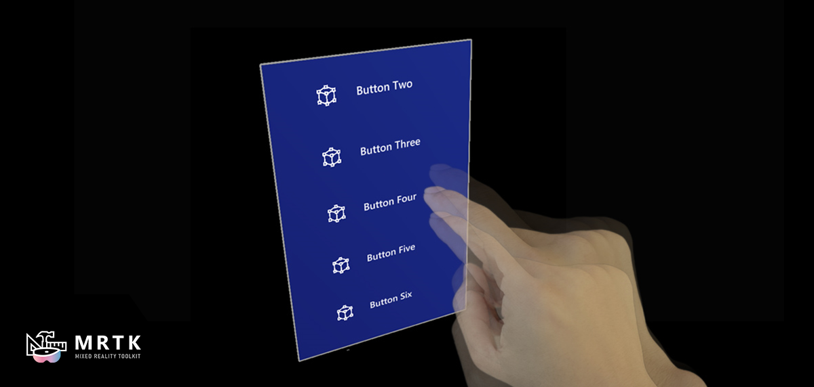
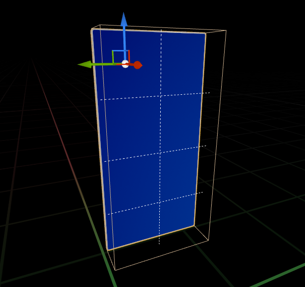
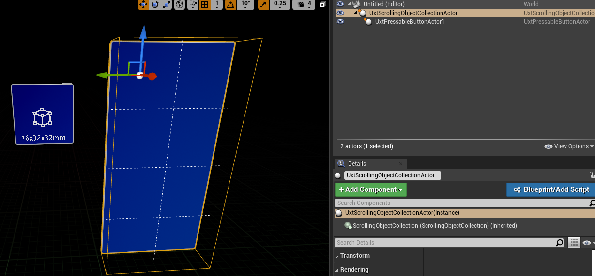
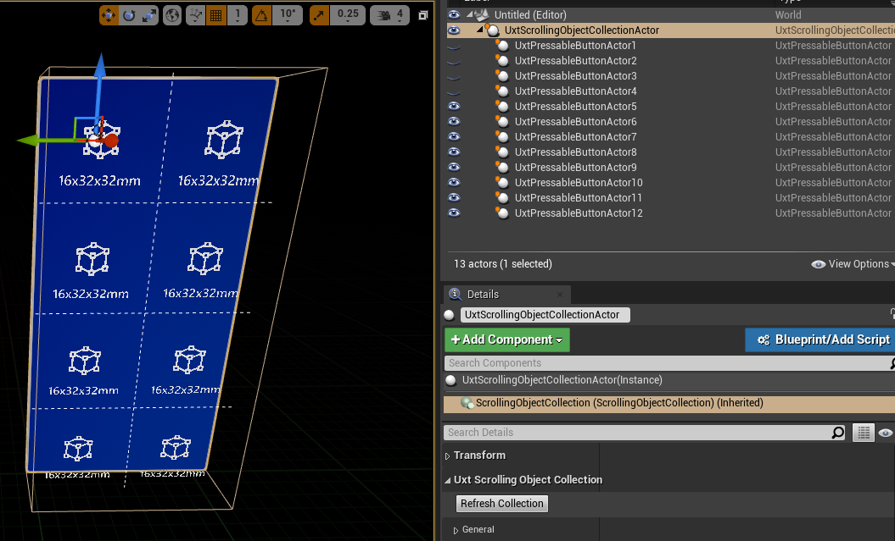
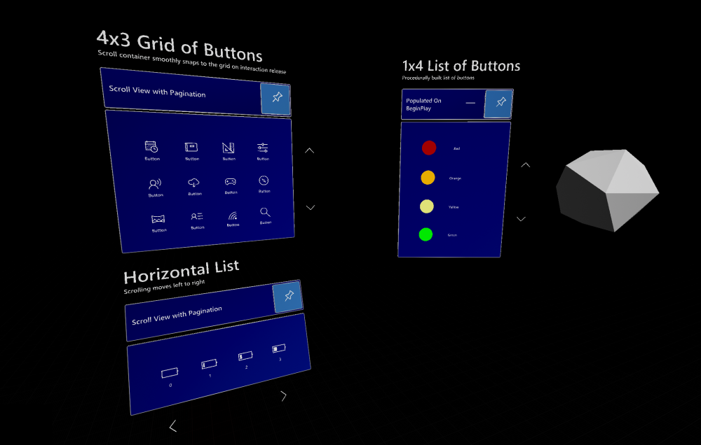
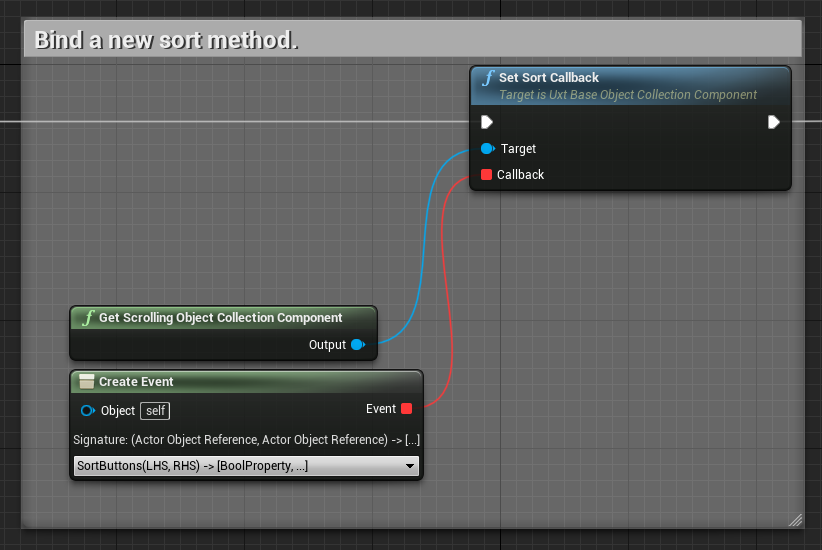
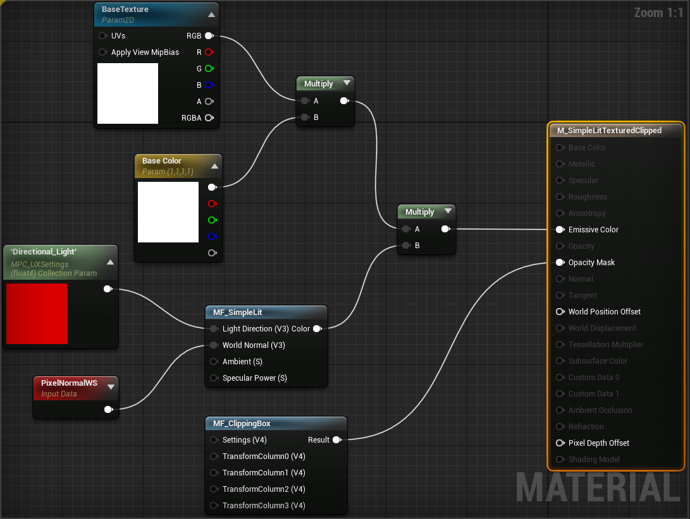

# Scrolling object collection

The scrolling object collection is an UX component that enables scrolling of 3D lists or girds of content through a contained viewable area. Scrolling movement can be triggered by near or far input interaction and by discrete pagination. It supports both interactive and non-interactive objects and can be populated via the world outliner or programmatically.

## Example level

There are some examples of various scrolling object collections within the `\UXToolsGame\Plugins\UXToolsExamples\Content\ScrollingObjectCollection\ScrollingObjectCollectionExample.umap` level.

Check out the `BP_ScrollingObjectCollectionExample` blueprint to see how scrolling object collections can be used in conjunction with other UX components. 

## Creating a scrolling object collection

Below we will walk though the steps to create, populate, and customize a scrolling object collection.

1. The quickest way to add a scrolling object collection to your level is to place a `UxtScrollingObjectCollectionActor` in the world outliner.
    * Note, the `UxtScrollingObjectCollectionActor` is a utility actor around the `UxtScrollingObjectCollectionComponent`. The component contains most of the logic and properties, and can be used without relying on the actor.

    * By default, the scrolling object collection is configured for a 2x4 grid of items. The checkered lines display the item boundaries.

    

2. Now that we have our scrolling object collection, let's add some items to it. The collection can be populated via the world outliner or programmatically. We will populate it with the world outliner. Please see the [advanced usage](#advanced-usage) section for programmatic population. A scrolling object collection will attempt to scroll any actor attached to it. Any actor can be attached to a scrolling object collection, but the most common use case is a button.
    * Drag and drop a `UxtPressableButtonActor` into the world outliner. Next, attach the button to the `UxtScrollingObjectCollectionActor` so that the button is a child of the collection.

    

    * If we start playing in editor the button will snap to the correct grid location in the scrolling object collection. If we want to preview the button's alignment we can click the "Refresh Collection" button on the  `UxtScrollingObjectCollectionComponent`.

    * To add more buttons to the collection simply duplicate the button 'x' times for however many you need. In this case we duplicated the button 12 times, checked off the "Is Plated" property on the buttons (since the collection has a back plate), and clicked the "Refresh Collection" button to align the buttons.
    
    

3. Finally, let's customize the scrolling object collection for different use cases by altering the `UxtScrollingObjectCollectionComponent`'s properties in the details panel.
    * In the `UxtScrollingObjectCollectionComponent` "Pagination" properties adjust the "Tiers" and "Viewable Area" properties to change the dimensions of the collections. Tiers and viewable area can be thought of as rows and columns in respect to the collection's scroll direction.
    * The "Cell Size" adjusts how much space each item occupies in the collection. It is best to adjust the cell size so that it encompasses the items placed into the collection. Although collections support non-homogenous collections of elements, the cell sizes are homogenous. The below image demonstrates a few scrolling object collection variations based on tiers, viewable areas, cell size, and scroll direction.

    

    * The scrolling object collection contains a built-in back plate. If the back plate isn't needed the collection contains a "Is Plated" check box in the "General" settings to toggle the back plate. The back plate can also be scaled up and down with the "Plated Padding" setting.
    * A handful of settings live in the "Advanced" panel of the `UxtScrollingObjectCollectionComponent`. Most of these settings affect the animation of the scroll. The "Snap to Strength" property is commonly adjusted to change if the collection snaps to item boundaries when scrolling completes.

## Advanced usage

### Programmatic population

Often the contents of the scrolling object collection isn't known until runtime. To add components dynamically you can use the `AddActorToCollection` method. An example of this can be found in the  `BP_ScrollingObjectCollectionExampleProcedural` blueprint. Note, this method attaches the actor to the collection's actor and calls "Refresh Collection." This method should not be called at edit time, instead actors can simply be attached to the collection actor.

### Sorting

The scrolling object collection builds the collection based on the actors attached to its owning actor. Attachments don't offer much flexibility for ordering items, to control the sort order of items you can provide a sort callback to the collection as seen below in blueprint.

### Input routing

It is not a requirement that items within a collection respond to input events. But, some items like buttons require it. If your item needs input properly propagated to it when a poke or tap is detected make sure the item implements the `UxtCollectionObject` interface. This interface will ensure the correct `UxtPokeHandler` and `UxtFarHandler` is selected.

### Pagination

It is convenient to allow users to quickly page though a long collection. To support this you can connect buttons outside of the collection to the `PageBy` or `MoveByItems` method. These methods can fail if scrolling is already taking place. A pagination end callback will notify the caller of error conditions when specified.

### Clipping

Because scrolling occurs in a "contained viewable area" users expect items which enter/leave the visible area to gradually become visible/invisible as they make the transition. Items fully outside or inside the collection are set to hidden or visible but items on the border get clipped on a per pixel basis within their material. For example the coffee cup in the below image is clipped as it leaves the bottom of the scrolling object collection.

By default materials do not support clipping, they must be modified. Most UI materials within UX Tools have already been modified to support clipping. To support clipping on any material first mark the material's blend mode as "Masked," then set the "Opacity Mask Clip Value" to zero. Finally add the `MF_ClippingBox` material function to your material's graph and hook the output to the "Opacity Mask" material input. An example of this can be seen below.

## More information
* [Pressable button](PressableButton.md)
* [Graphics](Graphics.md)
