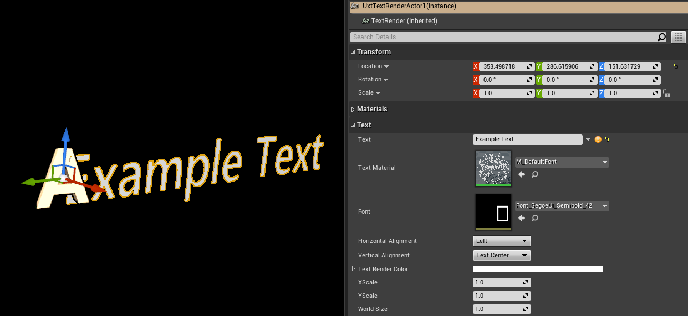
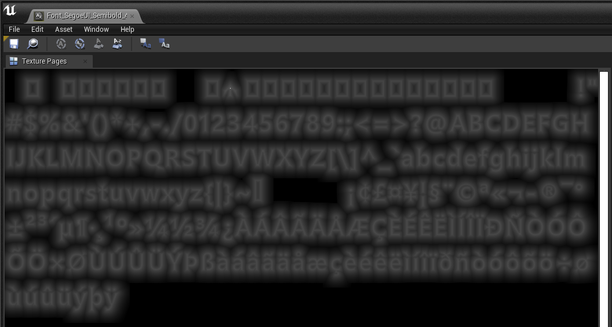

# Text

UX Tools contains assets, actors, and components which are optimized to render text correctly and efficiently on Mixed Reality devices. Text rendering within Mixed Reality can be challenging as opposed to traditional 2D text because text in Mixed Reality can be viewed from any angle or distance. Make sure text is large, high contrast, and accessible. More information about designing text for Mixed Reality can be found on this [page](https://docs.microsoft.com/en-us/windows/mixed-reality/typography). 

## Text Actors & Components

To provide automatic text configuration UX Tools contains an actor named `UxtTextRenderActor` and component named `UxtTextRenderComponent`. The `UxtTextRenderActor` and `UxtTextRenderComponent` automatically construct text with appropriate font, font material, and sizing defaults.

The `UxtTextRenderComponent` derives from the [TextRenderComponent](https://docs.unrealengine.com/en-US/API/Runtime/Engine/Components/UTextRenderComponent/index.html) and all properties can be accessed and altered via the top level `UxtTextRenderActor` component wrapper actor details panel:

It is recommended when adding new text to your level, or blueprint, that you begin with the `UxtTextRenderActor` or `UxtTextRenderComponent` and make adjustments where required. 

> [!NOTE] 
> If the text needs to be resized it is best to change the `World Size` property to avoid non-uniform scaling of text.

## Fonts

A library of recommended fonts are included with UX Tools. The primary font used for text is `Font_SegoeUI_Semibold_42` and `Font_SegoeUI_Bold_42`. Icons are normally rendered with a font (rather than a texture) and use the `Font_SegoeHoloMDL_Regular_42` and `Font_SegoeMDL2_Regular_42` fonts. The *SegoeHoloMDL* and *SegoeMDL2* fonts provide symbol glyphs commonly used in Windows Mixed Reality applications. To easily browse the glyphs available in a font try utilizing the a `UxtIconBrush` struct and [icon brush editor](Utilities.md#icon-brush-editor).

Most fonts within UX Tools are offline fonts, which are pre-computed font atlases. Offline fonts are less flexible than Unreal's [runtime fonts](https://docs.unrealengine.com/en-US/Engine/UMG/UserGuide/Fonts/Overview/index.html) but provided better performance results on HoloLens.

> [!NOTE] 
> UX Tools contains the runtime font `Font_SegoeUI_Semibold_Dynamic` for use with [UMG](https://docs.unrealengine.com/en-US/Engine/UMG/UserGuide/index.html) because offline fonts cannot be used with UMG.

Normally fonts include Unreal's default character set but some fonts, such as *SegoeHoloMDL* and *SegoeMDL2*, only import a subset of the default character set. To import additional characters you can perform the following actions:

1) Open the desired font. In this example `Font_SegoeMDL2_Regular_42`.
2) Navigate to the "Import Options" in the details panel.
3) Add any new characters needed to the "Chars" array property.

4) Select the font in the the content browser.
5) Right click on the font and select "Reimport."

### Importing a New Font

If you would like to use a custom font it is recommended that the font be imported following the below steps:

1) In a content browser right click and select *User Interface* > *Font*.
2) Name the font: *Font_FontName_FontStyle_FontSize*
3) Open the new font asset.
4) Change the "Font Cache Type" to "Offline" and select your font with the modal window that will appear.
5) Change the "Texture Page Width" and "Texture Page Max Height" to 1024 and 1024 (or a size that will fit your font within as little pages as reasonable possible). 
> [!NOTE] 
> Having multiple font pages can dramatically increases your application's draw call counts and hence rendering performance.
6) Check "Use Distance Field Alpha" to true.
7) Select your new font in the the content browser.
8) Right click on the font and select "Reimport." Depending on how many characters are in your font the reimport may take a few minutes.
> [!NOTE] 
> If the font import process takes an extremely long time you may want to constrain your font's character set using the "Character Set," "Chars," "Unicode Range," or "Chars File Path" properties under the font's "Import Options."

Once your font has reimported the font atlas should look similar to the below image. The characters should appear a little "blurred" because the font is stored as encoded signed distance field. You should now be able to use the font with the `M_DefaultFont` material.

## Materials

All text in UX Tools is rendered using the `M_DefaultFont` material. The `M_DefaultFont` material takes a font texture stored as a [signed distance field](https://en.wikipedia.org/wiki/Signed_distance_function) and displays the font as a unlit masked surface. [Masked surfaces](https://docs.unrealengine.com/en-US/Resources/ContentExamples/MaterialNodes/1_8/index.html) display either fully opaque or fully translucent pixels. Masked surfaces are great for text rendering because, unlike some other blend modes, it does not require sorting. But, masked surfaces can result in aliasing. If your application displays aliasing on text verify aliasing is occurring on your target stereo headset(s) (and not only within the play-in-editor viewport). If aliasing still occurs on your target headset(s) try increasing the size of your text.

If increasing text size is not an option for reducing aliasing you can utilize full screen [antialiasing techniques](https://docs.unrealengine.com/en-US/Engine/Rendering/PostProcessEffects/AntiAliasing/index.html) (such as MSAA or FXAA) on tethered Mixed Reality headsets. Full screen antialiasing is [not recommend on HoloLens](https://docs.microsoft.com/en-us/windows/mixed-reality/understanding-performance-for-mixed-reality#remove-gpu-stages) due to performance constraints. Local antialiasing can be an efficient way to reduce aliasing on text as well. To achieve local antialiasing duplicate the `M_DefaultFont` material and set the Material "Blend Mode" to "Translucent". Translucent materials can display pixel translucency values between opaque and transparent to provide a translucent gradient. Note, `Translucent` materials can provide reduced aliasing but may incur additional render cost due to [fill rate](https://docs.microsoft.com/en-us/windows/mixed-reality/understanding-performance-for-mixed-reality#understanding-bandwidth-vs-fill-rate) concerns or renderer sorting requirements.

## See also

- [Utilities](Utilities.md)
- [Graphics](Graphics.md)
