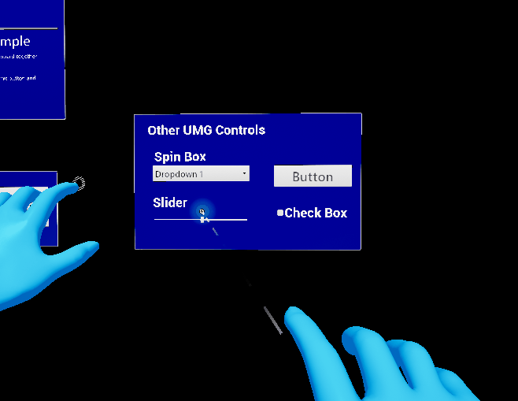
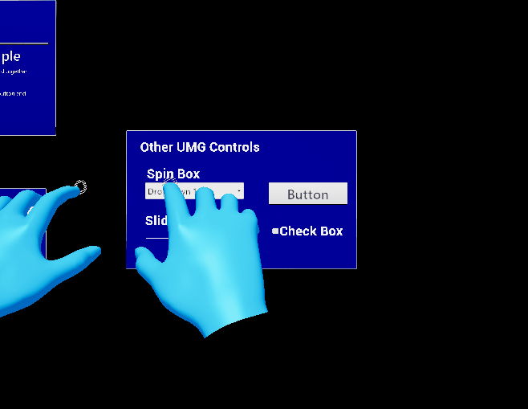

# FollowComponent

The UXT widget component is used to make UXT interaction work with Unreal Engine's own widget component.

## Usage

Create your widget as normal:
- Create a [widget class blueprint](https://docs.unrealengine.com/en-US/Engine/UMG/UserGuide/WidgetBlueprints/index.html) asset, and design your UI there.
- Create an actor and add a UE4 [widget component](https://docs.unrealengine.com/en-US/Engine/Components/Widget/index.html).
- Set the widget class to your widget asset.

After doing this, you should be able to see your widget when you play in editor. However, you will not be able to interact with the widget using the simulated hands. Stop play in editor and add a UXT widget component to your actor:

This should be all the set up required. When you play in editor now, you should be able to poke and far grab the ui elements in your widget actor.

## Behavior Details

The UXT widget component only supports far grab and near poke, and not near grab. For this reason, some UI elements may not behave like their UXT counterparts. For example, the slider widget follows the poking finger, whereas the UXT pinch slider requires a grab for near interaction.