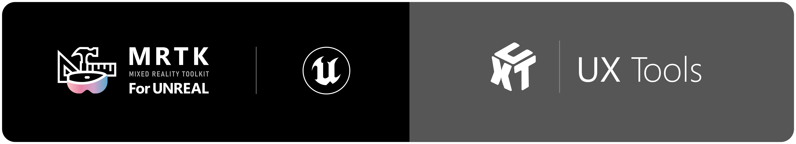

# What are the UX Tools?

UX Tools for Unreal Engine is a UE game plugin with code, blueprints and example assets created to help you add in features commonly needed when you're developing UX for Mixed Reality applications.

| NOTE: Only HoloLens 2 development is supported at the moment. |
| --- |

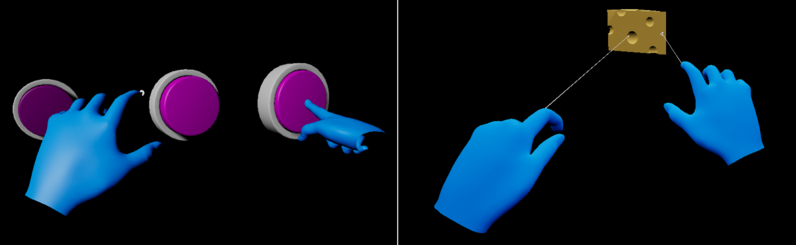

# Getting started with UX Tools

If you're new to MRTK or Mixed Reality development in Unreal, **we recommend starting at the beginning of our** [Unreal development journey](https://docs.microsoft.com/windows/mixed-reality/unreal-development-overview) in the Microsoft Docs. The Unreal development journey is specifically tailored to walk new developers through the installation, core concepts, and usage of the UX Tools.

| CAUTION: The Unreal development journey currently uses **UX Tools 0.11.x** and **Unreal 4.26.0+**. |
| --- |

If you're already familiar with Mixed Reality development in Unreal, you can find the installation instructions for the UX Tools plugin [here](Docs/Installation.md).

# Documentation

| [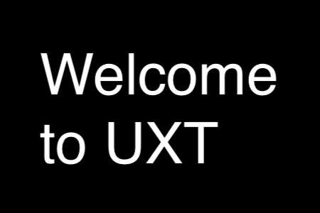](https://microsoft.github.io/MixedReality-UXTools-Unreal/Docs/WelcomeToUXTools.html) [Welcome to UX Tools](https://docs.microsoft.com/windows/mixed-reality/unreal-development-overview)|  [Feature Guides](https://microsoft.github.io/MixedReality-UXTools-Unreal/Docs/InputSimulation.html)|  [API Reference](https://microsoft.github.io/MixedReality-UXTools-Unreal/api/_a_uxt_hand_interaction_actor.html)|
|:---|:---|:---

# Required software

 |    [Windows SDK 18362+](https://developer.microsoft.com/windows/downloads/windows-10-sdk)|    [Unreal 4.26.0+](https://www.unrealengine.com/get-now)|    [Visual Studio 2019](http://dev.windows.com/downloads)|
| :--- | :--- | :--- |
| To build apps with MRTK-Unreal and UX Tools, you need the Windows 10 May 2019 Update SDK | The Unreal Engine provides support for building Mixed Reality projects in Windows 10 | Visual Studio is used for code editing |

# UX building blocks

| [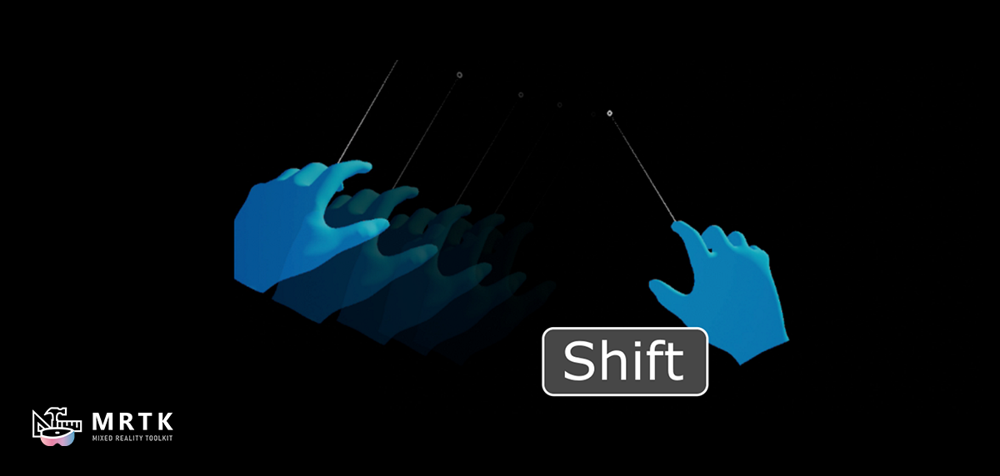](Docs/InputSimulation.md) [Input Simulation](Docs/InputSimulation.md) | [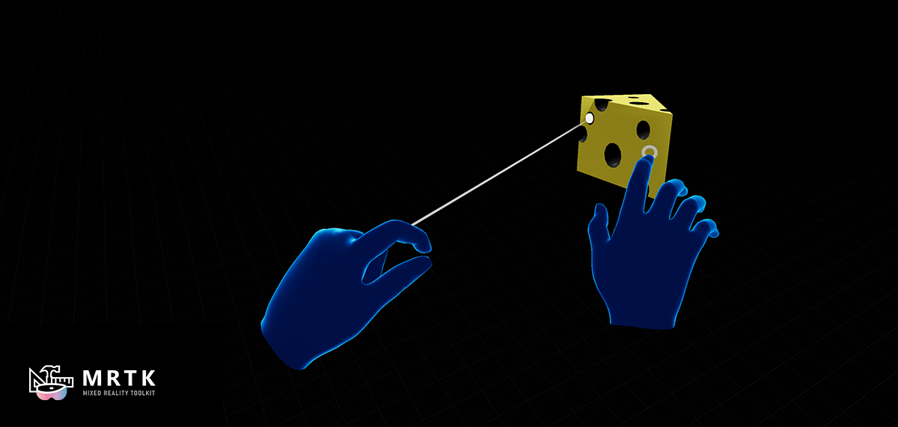](Docs/HandInteraction.md) [Hand Interaction](Docs/HandInteraction.md) | [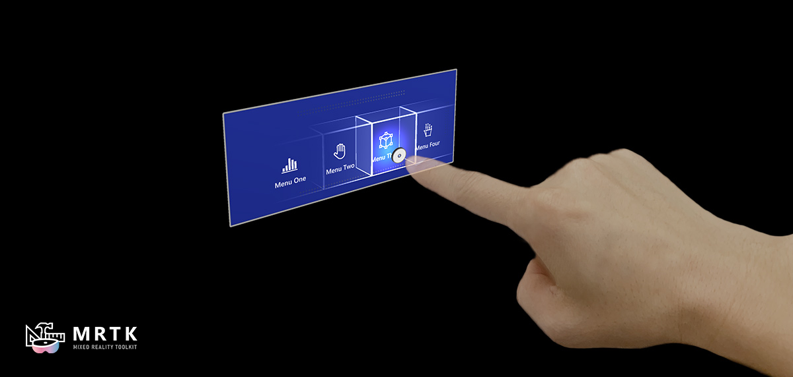](Docs/PressableButton.md) [Button](Docs/PressableButton.md) |
|:--- | :--- | :--- |
| In-editor simulation of articulated hands and headset pose | Support for far and near hand interactions with Unreal's primitives | A 3d button specifically designed for hand interactions |
| [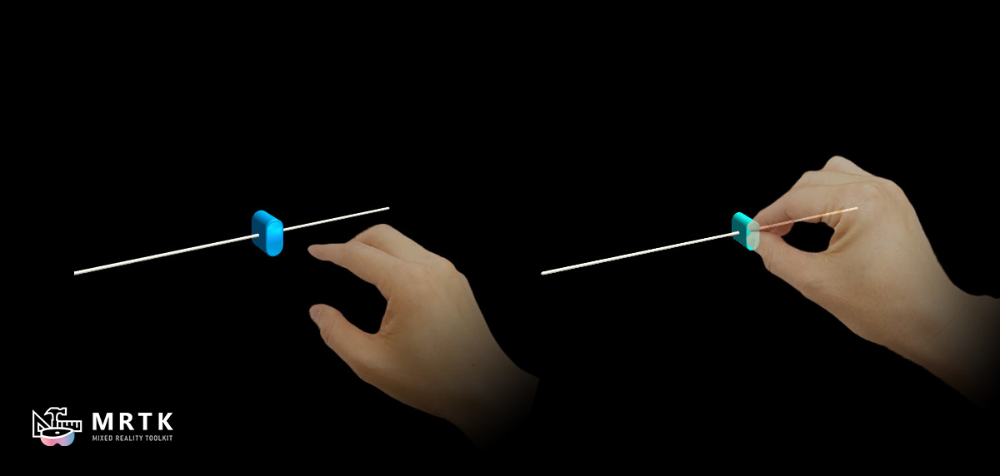](Docs/PinchSlider.md) [Slider](Docs/PinchSlider.md)| [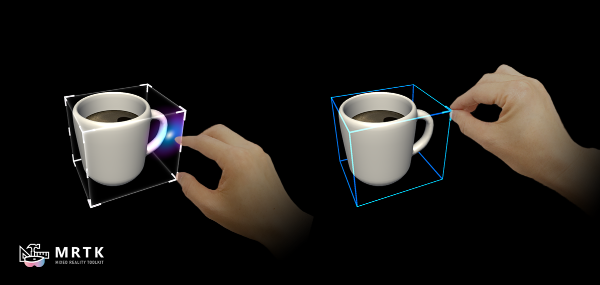](Docs/BoundsControl.md) [Bounds Control](Docs/BoundsControl.md)| [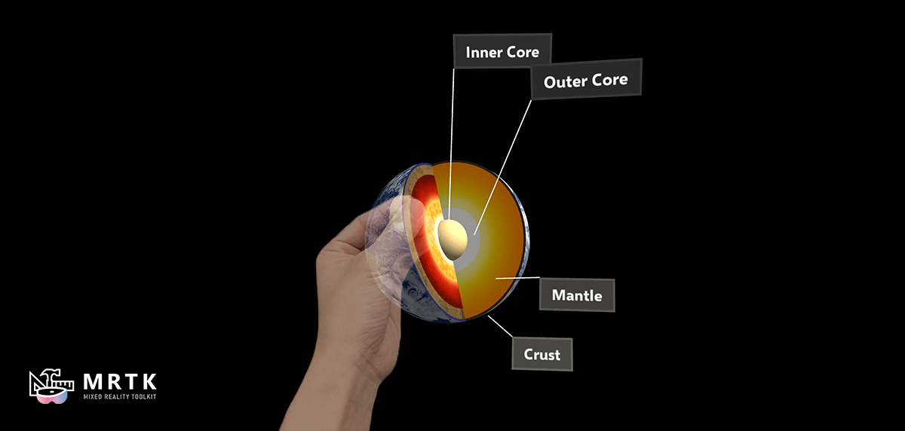](Docs/Manipulator.md) [Manipulators](Docs/Manipulator.md)|
| A 3d slider specifically designed for hand interactions | A component that allows the user to transform an actor via affordances | A component that allows an actor to be picked up by a user and then moved, rotated or scaled |
| [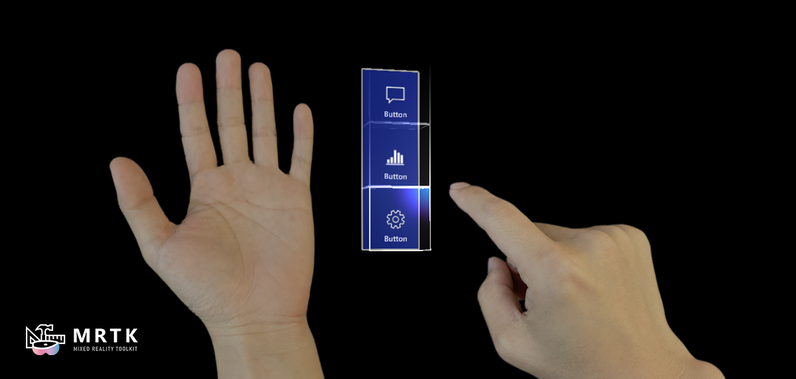](Docs/HandMenu.md) [Hand Menu](Docs/HandMenu.md) | [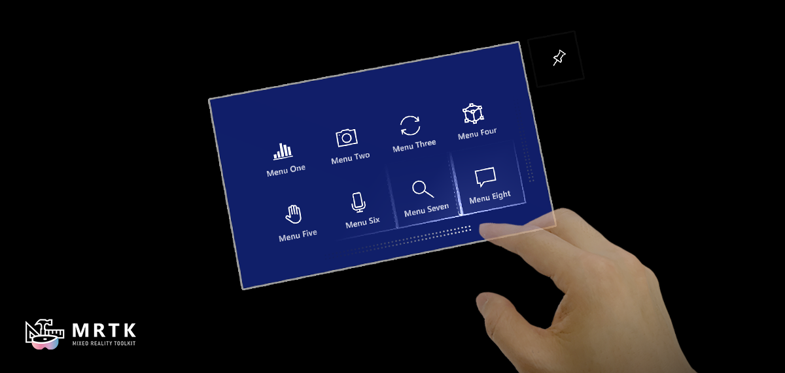](Docs/NearMenu.md) [Near Menu](Docs/NearMenu.md) |  [UMG support](Docs/WidgetComponent.md) |
| Hand-attached UI great for frequently used functions | Floating menu UI for near interactions | A component that allows hand-driven interactions with Unreal's UMG widgets |
| [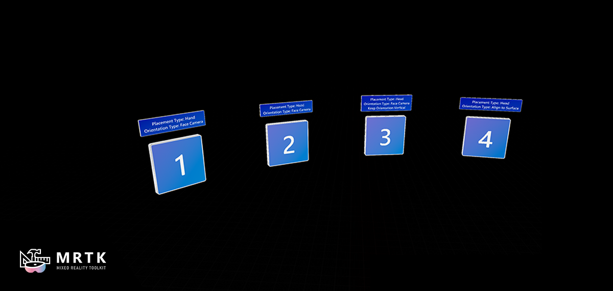](Docs/TapToPlaceComponent.md) [Tap to Place](Docs/TapToPlaceComponent.md) | [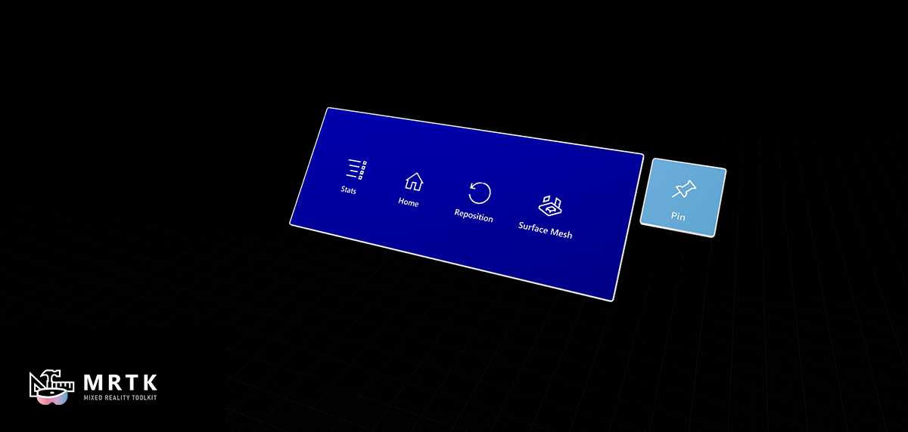](Docs/FollowComponent.md) [Follow Behavior](Docs/FollowComponent.md) | [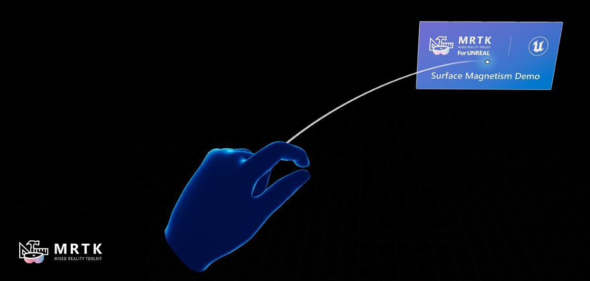](Docs/SurfaceMagnetism.md) [Surface Magnetism](Docs/SurfaceMagnetism.md) |
| A component that can be used to easily place primitive components against surfaces | A component used to keep objects "following" the user by applying a set of constraints on the component's owner | A component that allows an actor to stick to a surface |
| [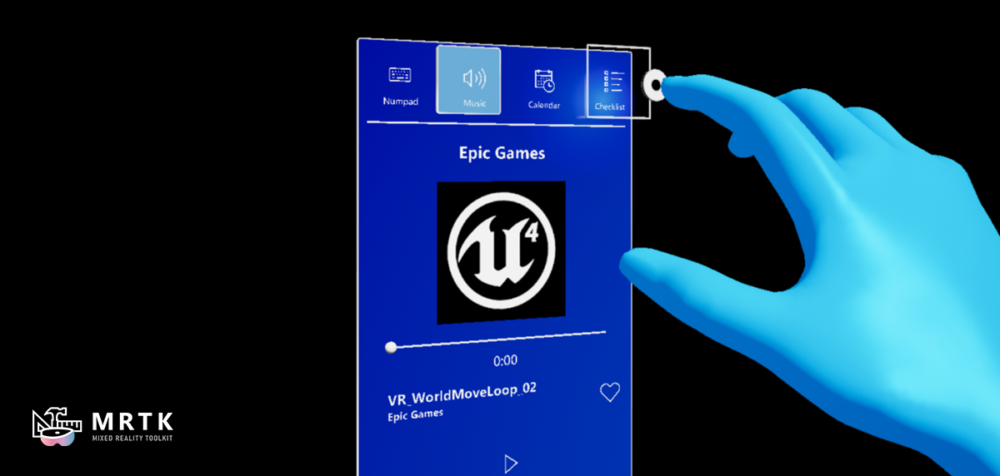](Docs/UIElements.md) [UI Element](Docs/UIElements.md) |
| A component that allows an actor's visibility to be controlled by its parent actor, allowing for easy construction of hierarchical UIs |

# Tools

|   [Utilities](Docs/Utilities.md) |  [Graphics](Docs/Graphics.md) | 
|:--- | :--- | 
| Plugin containing a handful of tools that augment the Unreal Engine editor | Breakdown of shaders, materials, and graphics techniques used to render UX components | 

# Example maps

If you want to explore the different UXT features or want a reference for how to use them, we recommend having a look at the example maps contained in the _UX Tools Examples_ plugin (/UXToolsGame/Plugins/UXToolsExamples). You can copy the examples plugin (along with the UXTools plugin) into 'Plugins' subfolder of your own project or you can simply try out the _UX Tools Game_ project (/UXToolsGame) in this repository. For that you should:

1. [Clone](https://help.github.com/en/desktop/contributing-to-projects/cloning-a-repository-from-github-to-github-desktop) this repository.
1. [Checkout](https://help.github.com/en/desktop/contributing-to-projects/switching-between-branches) the latest 'public/_version_.x' branch.
    * Bear in mind that this branch is alive. It's not a release, and will be **updated regularly with potentially breaking changes**. There will be a release tag (e.g. _release/0.11.0_) marked as such in GitHub.

You can now open the _UX Tools Game_ (/UXToolsGame) and explore individual example maps or open the _Loader_ level to access some of the examples from a centralized hub. You can also copy the examples (/UXToolsGame/Plugins/UXToolsExamples) into the 'Plugins' folder in your own project and use the pre-made elements as a base for your own Mixed Reality experience.

Please note that the example content might change significantly between releases. Please make sure to always run the examples with a matching version of the UX Tools Plugin as there might be breaking changes in the example code.

# Packaged UX Tools Game

We also provide the _UX Tools Game_ pre-packaged for HoloLens 2 so you can try out the main UXT features directly on device easily. To use it:

1. Obtain the packaged game from the latest release page (e.g. _UXTGame-HoloLens.0.11.0.zip_) and unzip it to a local directory.
1. Install it in the device via the [Device Portal](https://docs.microsoft.com/en-us/windows/uwp/debug-test-perf/device-portal#install-sideload-an-app).

# Sample apps made with UX Tools

| [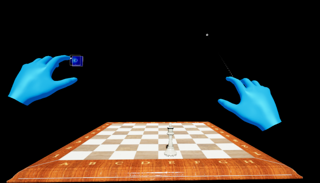](https://docs.microsoft.com/en-us/windows/mixed-reality/develop/unreal/tutorials/unreal-uxt-ch1) | [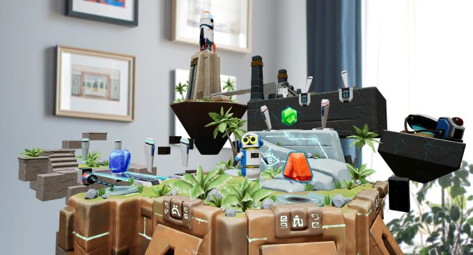](https://aka.ms/KippysEscape) |
|:--- |:--- |
| This simple [Chess App](https://github.com/microsoft/MixedReality-Unreal-Samples/tree/master/ChessApp) is the final result of following the getting started tutorial located on Microsoft's Mixed Reality docs. If you're new to Mixed Reality development and UX Tools, get started here: [Build a chess app with MRTK UX Tools](https://docs.microsoft.com/en-us/windows/mixed-reality/develop/unreal/tutorials/unreal-uxt-ch1) | [Kippy's Escape](https://github.com/microsoft/MixedReality-Unreal-KippysEscape) is an open-source HoloLens 2 sample app demonstrating how to use UX Tools components to create a fun and interactive Mixed Reality experience. Read the story behind the app: [The Making of Kippy's Escape](https://aka.ms/KippysEscape) |

# Feedback and contributions

Contributions and feedback in the shape of bug reports, suggestions and feature requests are always welcome! However, we are not in a position to accept external contributions through pull requests at this time.
