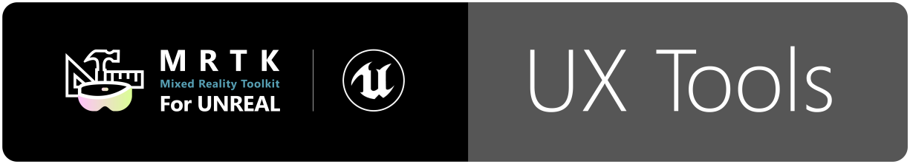

# Introduction

UX Tools for Unreal Engine is a UE game plugin with code, blueprints and example assets created to help you add in features commonly needed when you're developing UX for mixed reality applications. The project is still in early development (it provides a small set of features and breaking changes are to be expected) but the current features are complete and robust enough to use in your own projects.

> [!NOTE]
> Only HoloLens 2 development is supported at the moment.

Features:
- [Input simulation](Docs/InputSimulation.md) - Simulates articulated hands and head pose that you can use in-editor. This is great for improving development iteration times.
- [Hand interaction actor](Docs/HandInteraction.md) - Used to interact with our UX components with articulated hands.
- [Pressable button component](Docs/PressableButton.md) - Low level component used to drive the state of button blueprints. Example button blueprints are provided.
- [Pinch Slider](Docs/PinchSlider.md) - Allows the user to continuously change a value by moving the slider thumb along the track.
- [Bounds Control](Docs/BoundsControl.md) - Allows the user to change the position, rotation, and size of an actor, using _affordances_.
- [Hand Menu](Docs/HandMenu.md) - Allows users to quickly bring up a hand-attached UI for frequently used functions.
- [Manipulator component](Docs/Manipulator.md) - Allows moving, rotating and scaling an actor with either one or two hand manipulation.
- [Follow behaviour component](Docs/FollowComponent.md) - Keeps an actor or component within sight of another component, usually the camera.
- [Hand constraint component](Docs/HandConstraintComponent.md) - Keeps the actor position and rotation aligned with a hand while avoiding overlaping with it.
- [Palm up constraint component](Docs/PalmUpConstraintComponent.md) - A [Hand constraint](Docs/HandConstraintComponent.md) specialization that activates only when the palm is facing the player.
- [Far beam component](Docs/FarBeam.md) - Allows the user to visualise elements in the scene they can interact with from afar.
- [UIElement component](Docs/UIElements.md) - Allows for easily hiding/showing groups of UI elements (including nested panels) while remembering the individual visibility setting for each element.
- [Graphics documentation](Docs/Graphics.md) - Breakdown of shaders, materials, and graphics techniques used to render UX components.
- [Text documentation](Docs/Text.md) - Explanation of actors, materials, and fonts used to render text.
- The plugin also contains a handful of [utilities](Docs/Utilities.md) that augment the Unreal Engine editor.

# Getting started

First of all, make sure you have UE 4.25.3 or later. You can download it [here](https://www.unrealengine.com/get-now). Earlier versions are not supported.

## Prebuilt plugin

If you just want to add UXT to your game project, the quickest thing to do is to use the packaged plugin provided in the release page:
1. Obtain the packaged plugin zip from the latest release page (e.g. _UXTools.0.9.0.zip_).
1. Unzip the file directly into your project's _Plugins_ folder. The _Plugins_ folder should be located at the root of your project, where the _.uproject_ file is. Create it if it doesn't exist.
1. Make sure your game project is a code one, as opposed to blueprint-only, if you are planning to package it for HoloLens. Otherwise UE will fail to package it because it can't build the plugin sources.
1. Open your project and enable the _UX Tools_ plugin in the plugins menu.

You should now have access to all of the plugin features. The first thing you want to do is probably add a hand interaction actor per hand to your map or pawn so you can use your hands to drive the controls and behaviors provided in UXT. You can find a complete setup guide in the [Getting Started](https://docs.microsoft.com/windows/mixed-reality/unreal-uxt-ch1) tutorial series.

## Example maps

If you want to explore the different UXT features or want a reference for how to use them we recommend having a look at the example maps contained in the _UX Tools Game_ (/UXToolsGame) in this repository. For that you should:

1. [Clone](https://help.github.com/en/desktop/contributing-to-projects/cloning-a-repository-from-github-to-github-desktop) this repository.
1. [Checkout](https://help.github.com/en/desktop/contributing-to-projects/switching-between-branches) public/0.9.x.
    * Bear in mind that this branch is alive. It's not a release, and will be **updated regularly with potentially breaking changes**. There will be a release tag (e.g. release/0.9.0) marked as such in GitHub.

You can now open the _UX Tools Game_ (/UXToolsGame) and explore individual example maps or open the _Loader_ level to access some of the examples from a centralized hub.

## Packaged UX Tools game

We also provide the UX Tools game pre-packaged for HoloLens 2 so you can try out the main UXT features directly on device easily. To use it:

1. Obtain the packaged game from the latest release page (e.g. _UXTGame-HoloLens.0.9.0.zip_) and unzip it to a local directory.
1. Install it in the device via the [Device Portal](https://docs.microsoft.com/en-us/windows/uwp/debug-test-perf/device-portal-hololens).

# Documentation

The latest version of the documentation can be found [here](https://microsoft.github.io/MixedReality-UXTools-Unreal).

# Sample apps made with UX Tools

|  |  |
|:--- |:--- |
| This simple [Chess App](https://github.com/microsoft/MixedReality-Unreal-Samples/tree/master/ChessApp) is the final result of following the getting started tutorial located on Microsoft's Mixed Reality docs. If you're new to mixed reality development and UX Tools, get started here: [Build a chess app with MRTK UX Tools](https://docs.microsoft.com/en-us/windows/mixed-reality/develop/unreal/tutorials/unreal-uxt-ch1) | [Kippy's Escape](https://github.com/microsoft/MixedReality-Unreal-KippysEscape) is an open-source HoloLens 2 sample app demonstrating how to use UX Tools components to create a fun and interactive mixed reality experience. Read the story behind the app: [The Making of Kippy's Escape](https://aka.ms/KippysEscape) |

# Feedback and contributions

Due to the early stage of the project and the likelihood of internal refactors, we are not in a position to accept external contributions through pull requests at this time. However, contributions and feedback in the shape of bug reports, suggestions and feature requests are always welcome!
